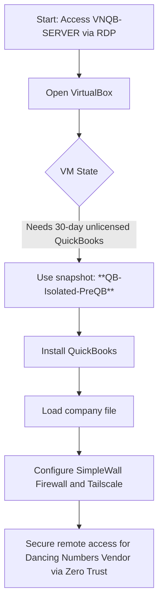
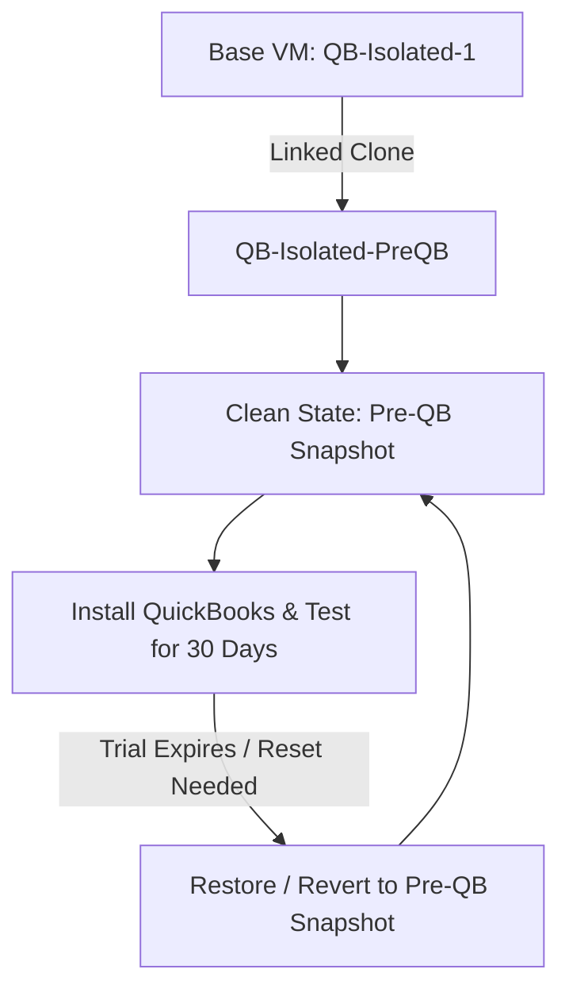

# QuickBooks UAT Sandbox Configuration and Access Guide

> [!INFO] Server Overview
> This Sandbox Server serves as a **UAT (User Acceptance Testing)** environment. It features restricted internet access managed by **SimpleWall** (an application-level firewall). 
> **Primary Objective:** Only allow the AppFolio API so the synchronizer between AppFolio and QuickBooks Desktop can call the API without exposing the server to the public internet insecurely.

> [!WARNING] Virtual Machine (VirtualBox) Warning
> The main linked virtual machine is `QB-Isolated`.
> **Please DO NOT DELETE `QB-Isolated` or `QB-Isolated-PreQB`.**

## Connection and Usage Workflow

## 1. Accessing the Server and Virtual Instances

1. Log into the host server.
2. The server is located at the internal IP: `192.168.0.68` with the hostname **VNQB-SERVER**.
3. Open **VirtualBox**.
4. ![[Pasted image 20260323152812.png]]

5. Use the virtual machine with the **`QB-Isolated-PreQB`** state exclusively.
   - *Configuration Note:* `QB-Isolated-PreQB` is a state prior to QuickBooks installation. It uses an unlicensed Non-Profit edition of QB Desktop, valid only for 30 days for QA computing and testing purposes.
6. Installation files are located on the host at: `C:\Users\nefil\OneDrive\Documents\Casa-Familiar-Sandbox-File` (includes the QB Installer).
   ![[Pasted image 20260323152812.png]]
7. The image above shows the VM in the "Pre-QB" state. In that snapshot, all configurations are already set (Tailscale and Firewall), except for QuickBooks.
8. Install QB and use the imported company file.
   ![[Pasted image 20260323153146.png]]

## 2. Credentials and Network (Zero Trust VPN)

### QuickBooks Company File Account
- **User:** `Admin`
- **Password:** `C@sa12345678`

### Tailscale Account
- **User:** `nefilcf@gmail.com`
- **Password:** `CasaF@2026..`

> [!INFO] NOTE:
> `nefilcf@gmail.com` is linked to the user `nefil@casafamiliar.org` for password recovery.

### Local Virtual Machine Accounts

- **Administrator:**
  - **User:** `admin`
  - **Password:** `CasaF@2026` (Local user)
- **Dancing Numbers (IT Vendor):**
  - **User:** `dancing-numbers`
  - **Password:** `12345678`
  - **Security Note:** Internet access is blocked by default for this account.
  ![[Pasted image 20260323153418.png]] 

### Tailscale VPN (Zero Trust)

Our vendor, Dancing Numbers, will be invited to use our VPN under a Zero Trust framework. This prevents exposing the QuickBooks database publicly.

**What is Tailscale and Why Use It?**
Tailscale is a zero-config mesh VPN built on WireGuard. We use it to create a Secure Intranet (Zero Trust Network) without opening external inbound ports on our main router or exposing the server to the public internet. This ensures the UAT server remains securely isolated while granting explicit, encrypted access only to authorized devices like our IT vendor.

**Configuration Requirements for Tailscale:**
- An active Tailscale Account (credentials provided above).
- The Tailscale application installed on both the UAT Server and the vendor's machine.
- Network authorization within the Casa Familiar Tailnet.
- Appropriate SimpleWall rules allowing `tailscaled.exe` and `tailscaled-ipn.exe` to communicate.

**Setup Steps:**
1. **Tailscale** is the mesh VPN software configured in this UAT sandbox.
   ![[Pasted image 20260323154003.png]]
2. **VPN Invitation (Example):** `https://login.tailscale.com/uinv/i3eoGdyebi11VwJTaTNs221`
3. Once the Tailscale client is configured on the vendor's side, they connect via **RDP** using the Tailnet hostname `qb-sandbox` or the assigned Tailscale IP — no additional NAT configuration required.

## 3. Firewall Rules (SimpleWall)

We use **SimpleWall**, a free open-source firewall application that is stricter and more application-oriented than the native Windows Defender Firewall.

![[Pasted image 20260323154218.png]]

- **Essential Allowed Services:** Always ensure the green checkbox is enabled for RDP and Tailscale.
  - `simplewall.exe`
  - `svchost.exe`
  - `System` (Required for Windows background tasks and baseline RDP)
  - `tailscaled.exe` and `tailscaled-ipn.exe` (Mandatory for the Zero Trust VPN network)
- **Web Browsing:** If using a web browser is absolutely necessary (admin only), temporarily allow `msedge.exe` with a simple check.

## 4. Virtual Machine Snapshot Workflow

Proper snapshot management is critical to maintain the 30-day unlicensed testing environment for QuickBooks.

**Snapshot Architecture:**
- **`QB-Isolated-1`**: The base virtual machine installation.
- **`QB-Isolated-PreQB`**: This is a **linked clone** of `QB-Isolated-1`. All testing and QuickBooks installations must happen exclusively within this linked clone to preserve the base image.

**Snapshot Reset Flow:**
When the 30-day QuickBooks trial expires, or a fresh UAT environment is needed, follow this workflow exclusively on `QB-Isolated-PreQB`:
1. Ensure the VM is powered off.
2. Select the `Pre-QB` snapshot within VirtualBox.
3. Click **Restore** (or Revert). This discards the "Current State" and all 30 days of usage.
4. Boot the VM. It will instantly return to the exact clean pre-installation state.

![[Pasted image 20260324131556.png]]

## Final Notes & UAT Operations

- Once RDP and Tailscale are configured, connection should be seamless from any approved device within the Casa Familiar IT department.
- For heavy administrative tasks, log directly into `VNQB-SERVER`.
- *Best Practice:* Always manage versions by reverting to the mentioned VirtualBox snapshots. Never work or save states over the base installation (`QB-Isolated-1`) unless applying a forced patch.
