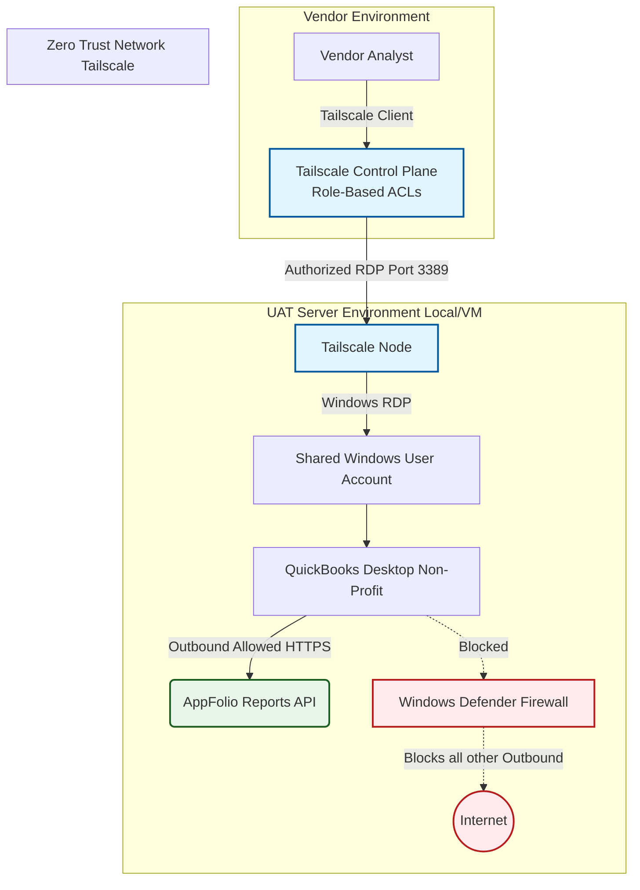

# UAT Server Architecture & Zero Trust Setup

## 1. Overview
This document outlines the architecture and deployment strategy for the User Acceptance Testing (UAT) server hosting **QuickBooks Desktop Non-Profit**. The server integrates with the **AppFolio Reports API**. 

To maintain strict security compliance for Casa Familiar, this server operates under a **Zero Trust model**. The vendor will access the environment via a shared RDP account over **Tailscale (Free Version)**, ensuring the server remains isolated from the public internet while retaining critical access to the AppFolio Reports API.

## 2. Security & Network Restrictions
- **Inbound Traffic**: Blocked entirely at the network firewall level. No external open ports (e.g., TCP 3389 for RDP) are exposed to the internet.
- **Outbound Traffic**: Highly restricted. General internet browsing is blocked. Only outbound connections to the **AppFolio Reports API** and **Tailscale coordination servers** are permitted.
- **Remote Access (Vendor)**: Vendor connects via a single, shared local Windows User Account strictly over **Tailscale**.

---

## 3. Architecture Workflow

The following diagram illustrates the secure connection workflow using Tailscale to bridge the vendor and the application without exposing it to the open web.



---

## 4. Low-Code Automation Suggestions
As an IT Analyst focusing on efficient configuration, here are two simple low-code scripts to help manage and automate this restricted environment:

### A. Simplewall Configuration (Zero-Trust Enforcement)
Casa Familiar uses **Simplewall** to visually enforce the default-deny Zero Trust model, replacing complex PowerShell scripts.

> [!IMPORTANT] Administrator Access Required
> Simplewall runs on the Windows Filtering Platform (WFP). You must configure these rules while logged in as an Administrator before handing over the `UAT-Vendor` account.

**Explicit Allowlist (Whitelist) Required:**
To ensure the vendor can connect via Tailscale, execute QuickBooks, and reach the AppFolio API without browsing the internet, explicitly allow the following executables in Simplewall:

1. **Tailscale Services (Critical for RDP access):**
   - `C:\Program Files\Tailscale\tailscaled.exe` (The background daemon)
   - `C:\Program Files\Tailscale\tailscale.exe` (The CLI/GUI client)
   
2. **QuickBooks & API Access:**
   - `C:\Program Files\Intuit\QuickBooks 2024\qbw32.exe` (Adjust for exact QB version. This executable makes the outbound AppFolio API calls).

3. **Core Windows Services (Required for RDP & Network):**
   - `C:\Windows\System32\svchost.exe` (Windows Services Host)
   - `System` (NT Kernel & System - required for basic network operations)

**Configuration Steps:**
1. Open Simplewall and click **Settings**.
2. Enable **Load on system startup** (Crucial para que la interfaz se inicie, aunque los filtros WFP persisten a nivel sistema).
3. Under the **Rules** tab, ensure the mode is set to **Block (default-deny)**.
4. Check the boxes next to the executables listed above.
5. Click **Enable filters** to activate WFP rules.

> [!NOTE] Comportamiento ante Reinicios
> Los filtros de red (WFP) que Simplewall instala operan a nivel de kernel, lo que significa que el bloqueo de internet se mantendrá activo **incluso inmediatamente después de un reinicio** antes de que los usuarios inicien sesión. Al activar "Load on system startup", garantizas que el servicio de control y la interfaz GUI también arranquen para cualquier gestión necesaria en el entorno Zero-Trust.

### B. Auto-Start Tailscale & QB Script (Batch)
Place a shortcut to this `.bat` script in the shared `UAT-Vendor` user's Windows Startup folder so the environment initializes properly upon login.

```bat
@echo off
echo Starting Tailscale Verification and QuickBooks...
start "" "C:\Program Files\Tailscale\tailscale.exe" up
timeout /t 5 /nobreak
start "" "C:\Program Files\Intuit\QuickBooks 2024\qbw32.exe"
exit
```

---

## 5. Tailscale Zero-Trust Configuration Guide

1. **Create a Tailscale Network**: Use the Casa Familiar IT administrator account to create the free tier environment.
2. **Authorize the Server**: Install Tailscale on the UAT VM and authenticate. Disable key expiry for this specific machine so the vendor does not lose access abruptly.
3. **Share the Node**: Use Tailscale's "Share Node" feature to invite the Vendor's explicit email address, restricting their capabilities to ONLY this server. This prevents them from lateral movement in the Casa Familiar network.
4. **Local Windows User**: Create a standard local user (e.g., `UAT-Vendor`). Provide these credentials strictly for the RDP login screen *after* they securely connect via Tailscale.
