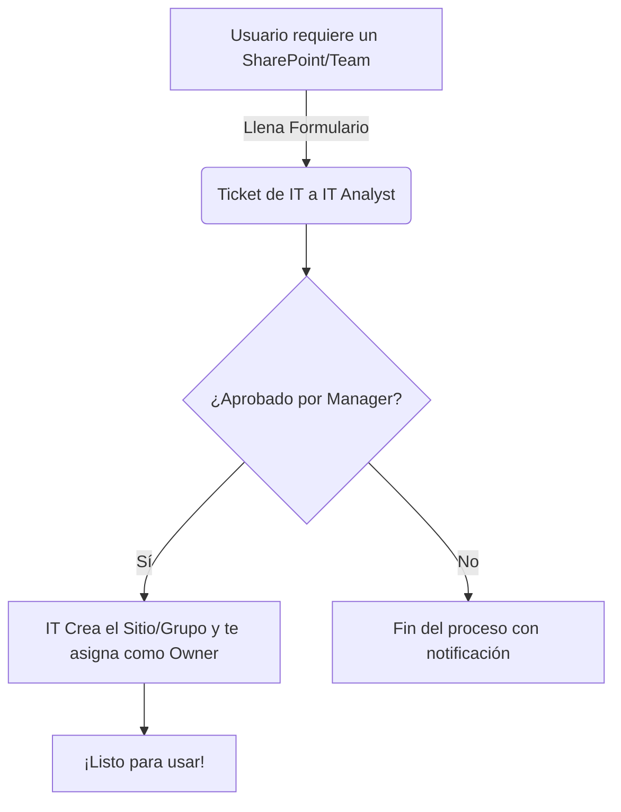

# 🚀 Versión "Para Dummies": Creación de Equipos y Sitios en M365

> [!NOTE] 
> **Contexto IT**: Por políticas de seguridad y organización en Casa Familiar, los usuarios estándar ya no pueden crear Grupos, Sitios de SharePoint o Microsoft Teams libremente. Todo debe pasar por IT.

## ¿Qué cambió y por qué?
A partir de [Fecha/Ahora], el botón de **"Crear Sitio"** o **"Crear un Equipo"** ya no está habilitado. Esto se hace para:
- Evitar sitios duplicados o abandonados ("Shadow IT").
- Mantener la información de Casa Familiar centralizada y segura.

## 🛑 ¿Qué pasa si necesito un nuevo Equipo de Teams o un Sitio de SharePoint?

¡No te preocupes! El departamento de IT te lo crea. Solo necesitas seguir estos **3 sencillos pasos**:

### 1️⃣ Solicítalo por [AQUÍ PONER EL MEDIO: Ticket / MS Forms / Correo]
> *(Ejemplo: Llena este formulario de Microsoft Forms)*
**Link de solicitud:** [Ingresar Link Aquí]

### 2️⃣ Aprobación
Tu manager o director [AQUÍ: Especificar si requiere aprobación o si pasa directo a IT].

### 3️⃣ IT lo configura por ti
En un periodo de [AQUÍ: Ejemplo 24-48 horas], el equipo de IT creará:
- Tu nuevo equipo de Teams.
- Tu biblioteca de documentos de SharePoint.
- Te agregará como Dueño (Owner) para que puedas invitar a quien necesites.

---

## 🛠️ Flujo de Aprobación (Para Referencia)

