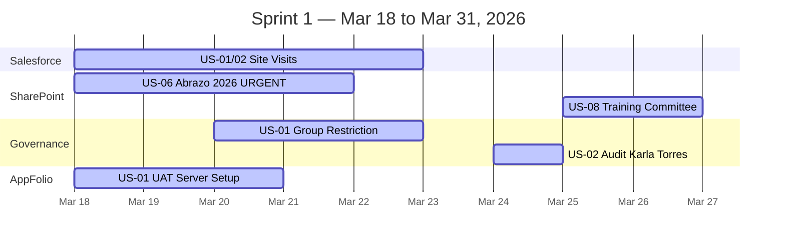

# Master Sprint Plan (Agile-Lite)

This document organizes the User Stories of all active projects in 2-week Sprints starting on Wednesdays. All future sprints have been detailed for JIRA tracking with Acceptance Criteria and Low-Code suggestions where applicable.

> [!WARNING]
> **Emergency Adjustment**: Sprint 1 load was increased to include the **Abrazo 2026** event and **IT Governance** audit. Strict Time Boxing is required.

---

## Sprint 1 (Mar 18, 2026 - Mar 31, 2026) — IN PROGRESS

**Focus**: Urgency Abrazo 2026 + Tenant Security + Salesforce Discovery
**Real Capacity**: ~25-30 SP (High Load - Requires extra hours or full focus)
**Total Story Points**: 28 pts (Prioritized)

### SharePoint Events & Governance

| ID | User Story | SP | Status |
|----|-----------|:---:|--------|
| SP-US06 | **Create Urgent Abrazo 2026 Site** | 8 | TO DO |
| SP-US08 | **Events Committee Training & Sync** | 3 | TO DO |
| GOV-US01| **Tenant-Wide Group Creation Restriction** | 8 | TO DO |
| GOV-US02| **User Access Audit: Karla Torres** | 2 | TO DO |

### Salesforce & AppFolio

| ID | User Story | SP | Status |
|----|-----------|:---:|--------|
| SF-US02 | **FOC Site Visit (Mayra)** | 3 | TO DO |
| AF-US01 | **Finalize UAT Server Setup** | 4 | TO DO |

---

## Sprint 2 (Apr 1, 2026 - Apr 14, 2026)

**Focus**: Abrazo Consolidation + Salesforce Mapping + Hub Architecture
**Planned Story Points**: 22 pts

### [Epic] SharePoint Events Architecture

- [ ] **[Story] SP-US01: Hub Site & Global Column Setup**
  - **Story Points**: 5
  - **Priority**: High
  - **Description**: As a SharePoint Administrator, I need to configure the main Hub Site and define global columns to ensure a standard structure across all committee sites.
  - **Low-Code Suggestion**: Create a simple Power Automate flow that triggers when a new file is uploaded to the main document library, automatically tagging it with the correct department metadata.
  - **Acceptance Criteria**:
    - Hub Site is successfully created and registered in the SharePoint Admin Center.
    - Global columns are defined and cross-site inheritance is confirmed.
    - Global navigation links are active and functional across associated sites.

- [ ] **[Task] SP-T07: Committee Leads Discovery & Outreach**
  - **Story Points**: 5
  - **Priority**: Medium
  - **Description**: As an IT Analyst, I need to contact past leaders (Karla/Ricardo) to retrieve historical information and documents for the new SharePoint structure.
  - **Acceptance Criteria**:
    - Outreach emails are sent to past leaders.
    - Historical files and knowledge are organized and uploaded to the new Hub Site.

### [Epic] Salesforce Reporting & Operations

- [ ] **[Story] SF-US03: KPI Specification for Social Services & FOC**
  - **Story Points**: 5
  - **Priority**: High
  - **Description**: As an IT Analyst, I need to document the KPIs required by Social Services and FOC to properly map and configure Salesforce dashboards.
  - **Low-Code Suggestion**: Use Salesforce Native Reports Builder (no-code) to draft initial mockups of the KPIs before building complex dashboards.
  - **Acceptance Criteria**:
    - KPI documentation is created and officially approved by Gema.
    - All requested KPIs are successfully mapped to existing or planned Salesforce objects.

- [ ] **[Task] SF-T01: Social Services Site Visit (Gema)**
  - **Story Points**: 3
  - **Priority**: Medium
  - **Description**: As an IT Analyst, I need to conduct an interview and site visit with Gema to map the current operational workflow for Social Services.
  - **Acceptance Criteria**:
    - Interview is completed and detailed notes are added to the Obsidian knowledge base.
    - Current workflow is diagrammed using Mermaid in the documentation.

### [Epic] AppFolio & QuickBooks Integration

- [ ] **[Task] AF-T03: Accounting Data Validation in Sandbox**
  - **Story Points**: 4
  - **Priority**: High
  - **Description**: As an IT Analyst, I need to validate the synchronized accounting data with our vendor (Dancing Numbers) inside the isolated UAT Sandbox using Tailscale.
  - **Acceptance Criteria**:
    - Vendor successfully connects via Tailscale Zero Trust VPN without public internet exposure.
    - Data synchronization between AppFolio and QuickBooks Desktop completes without critical errors.
    - Financial data accuracy is validated and approved by the accounting team.

---

## Sprint 3 (Apr 15, 2026 - Apr 28, 2026)

**Focus**: Automated Provisioning + Salesforce Historical Data
**Planned Story Points**: 18 pts

### [Epic] SharePoint Automation

- [ ] **[Story] SP-US02: Site Script & Site Design Development**
  - **Story Points**: 8
  - **Priority**: High
  - **Description**: As a Microsoft 365 Administrator, I want to automate SharePoint site creation using JSON Site Scripts to standardize every new project and committee site deployment.
  - **Low-Code Suggestion**: Use the Microsoft Site Script JSON schema to define lists, themes, and navigation in a simple text file, avoiding complex custom C# code.
  - **Acceptance Criteria**:
    - JSON Site Script is written and uploaded to the M365 tenant via PowerShell.
    - A new Site Design is registered combining the Site Script.
    - A test site is successfully spun up using the new automated Site Design.

### [Epic] Salesforce Migration

- [ ] **[Story] SF-US05: Historical Data Migration Strategy**
  - **Story Points**: 10
  - **Priority**: High
  - **Description**: As a Salesforce Administrator, I need to design the migration strategy to move all historical data from legacy systems into the new Salesforce environment.
  - **Low-Code Suggestion**: Use DataLoader.io for simple, interface-driven CSV uploads with automated mapping instead of writing Apex data migration scripts.
  - **Acceptance Criteria**:
    - Data Dictionary and field mapping document is completed.
    - The official migration tool is selected and configured.
    - A successful test migration is executed in the Salesforce UAT Sandbox.

---

## Sprint 4 (Apr 29, 2026 - May 12, 2026)

**Focus**: Salesforce Testing + AppFolio Production Deployment
**Planned Story Points**: 15 pts

### [Epic] Salesforce Validation

- [ ] **[Task] SF-T10: Salesforce User Flow UAT Testing**
  - **Story Points**: 8
  - **Priority**: High
  - **Description**: As an IT Analyst, I need to perform User Acceptance Testing (UAT) on the Salesforce platform targeting the operational flows of the agency.
  - **Acceptance Criteria**:
    - UAT Test Plan is written and distributed to key stakeholders.
    - Testing sessions are conducted.
    - All discovered bugs and issues are reported into the JIRA backlog for resolution.

### [Epic] AppFolio Integration

- [ ] **[Story] AF-US05: QB-AppFolio Production Deployment**
  - **Story Points**: 7
  - **Priority**: Critical
  - **Description**: As an IT Admin, I want to deploy the AppFolio-QuickBooks synchronizer in the live production server following a strict Zero Trust framework.
  - **Acceptance Criteria**:
    - SimpleWall firewall is installed and strictly configured on the production VM.
    - Tailscale is deployed for secure vendor RDP access.
    - Initial production data sync is completed with direct supervision from the Accounting Director.

---

## Capacity Overview

| Sprint | Dates | Story Points | Status |
|--------|--------|:---:|--------|
| Sprint 1 | Mar 18 – Mar 31 | 28 | **HIGH LOAD** |
| Sprint 2 | Apr 1 – Apr 14 | 22 | Planned |
| Sprint 3 | Apr 15 – Apr 28 | 18 | Planned |
| Sprint 4 | Apr 29 – May 12 | 15 | Planned |

> [!CAUTION]
> Sprint 1 is overloaded (28 SP). It is recommended to prioritize **Abrazo 2026** and **Governance** over AppFolio tasks given the time constraints.
