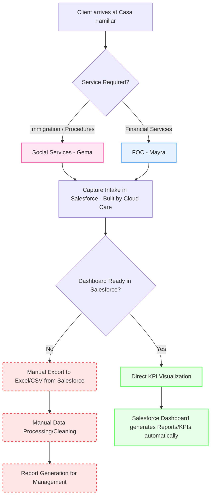

# Current Workflow Drafts

This is a preliminary flowchart. Update this diagram based on your discoveries after interviewing Gema and Mayra.

## General Intake and Reporting Process

### Automation Analysis:
Steps marked with dashed borders (manual export & processing) are our **Pain Points**. As an IT Analyst, this is where we introduce "Low-Code" solutions:
- **Bash/Python scripts** to process exported CSVs.
- **Power Automate** to move data from Salesforce to SharePoint/Excel automatically.
