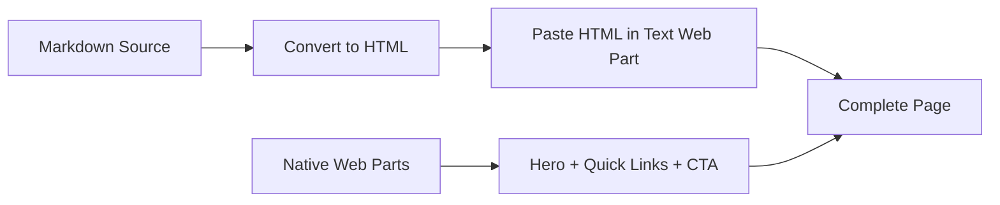

# SharePoint Home Page - Markdown + Web Parts Alternative

## Approach Overview

This alternative combines **Markdown converted to HTML** (for rich content) with **native Web Parts** (for visual elements). The advantage is you maintain your content in Markdown and only convert it once.

### How It Works



| Element | Method | Why |
|---------|--------|-----|
| Banner/Hero | Native **Hero** web part | Only a native web part can render a full-width banner with overlay |
| Quick Links | Native **Quick Links** web part | Responsive grid with icons, impossible to replicate with text |
| RunSignUp link | Native **Call to Action** web part | RunSignUp blocks iframe embedding (X-Frame-Options) |
| All text content (descriptions, schedule, pricing, highlights, contacts) | **Markdown converted to HTML** pasted in Text web parts | Maintain a single source in Markdown, convert and paste |

---

## Step 1: Convert Markdown to HTML

There are 3 options for conversion. Choose whichever is most comfortable:

### Option A: Obsidian Export (Recommended)
1. Open this file in Obsidian
2. Right-click on the file > "Export to PDF" or install the "Copy as HTML" plugin
3. With the plugin: select the text block > Copy as HTML > Paste in SharePoint

### Option B: Online Tool (No install needed)
1. Open https://markdowntohtml.com
2. Copy each Markdown block from below
3. Paste in the tool and copy the resulting HTML
4. Paste in the SharePoint Text web part (SharePoint accepts pasted HTML)

### Option C: PowerShell Script (Low-Code)
```powershell
# Requires PSMarkdown module or pandoc installed
# With pandoc (install from https://pandoc.org):
pandoc "01a-SharePoint-Markdown-Alternative.md" -f markdown -t html -o "abrazo-home.html"
# Open abrazo-home.html in browser and copy the content
```

> [!TIP]
> **Fastest method**: Use Option B (markdowntohtml.com). Copy each block below, convert, and paste directly in the SharePoint Text web part. SharePoint preserves HTML when pasting.

---

## Step 2: Page Structure

Build the page in this order. Each section indicates if it uses a **native Web Part** or **Markdown/HTML**.

---

### Section 1: Hero Banner

> **Method**: Native **Hero** web part
> Do NOT use markdown here. Configure directly in SharePoint.

| Setting | Value |
|---------|-------|
| Layout | One layer |
| Title | Abrazo 2026 -- Committee Hub |
| Subtitle | 5K Walk & 10K Run | Saturday, May 2, 2026 | Las Americas Premium Outlets |
| CTA Text | View Task List |
| CTA Link | *(link to the SharePoint Tasks list once created)* |
| Image | Upload event flyer/banner with Rasta theme |

---

### Section 2: Event Overview

> **Method**: Markdown -> HTML -> Paste in **Text** web part

Copy this block, convert to HTML, and paste:

```markdown
## About the Event

The Abrazo 5K Walk & 10K Run takes participants along the scenic San Ysidro-Tijuana border. This year's Abrazo embraces the theme **"Get Up, Stand Up."** Inspired by Bob Marley's words, *"One love, one heart, let's get together and feel all right,"* we honor his legacy of using music to uplift voices, champion social justice, and spread messages of love, unity, and resilience.

Casa Familiar continues this spirit through our mission of Advancing Communities -- even in the face of adversity -- by celebrating the strength of our comunidad. Join us to uplift community wins and support Casa's programs. As a participant, you'll help us meet growing needs while celebrating together.

Expect lively **Rasta vibes**, energizing music, and two special awards presented after the race during a short closing program.
```

---

### Section 3: Event Details & Schedule

> **Method**: Markdown -> HTML -> Paste in **Text** web part
> **Suggested layout**: Use a **two-column section** in SharePoint. Left column = Details. Right column = Schedule.

**Left Column** -- Copy and convert:

```markdown
## Event Details

| | |
|---|---|
| **Date** | Saturday, May 2, 2026 |
| **Time** | 6:30 AM - 11:00 AM |
| **Location** | Las Americas Premium Outlets |
| **Address** | 4061 Camino De La Plaza #490, San Ysidro, CA 92173 |
| **Theme** | "Get Up, Stand Up" (Rasta) |
| **Expected** | 300+ participants |
```

**Right Column** -- Copy and convert:

```markdown
## Day-of Schedule

| Time | Activity |
|------|----------|
| 6:30 AM | Registration Opens |
| 7:00 AM | Welcome Ceremony |
| 7:30 AM | 10K Run Start |
| 7:35 AM | 5K Walk Start |
| 8:45 - 11:00 AM | Awards & Raffles |
```

---

### Section 4: Quick Links

> **Method**: Native **Quick Links** web part
> Do NOT use markdown here. Configure directly in SharePoint.

| # | Link Title | URL |
|---|------------|-----|
| 1 | Task List | SharePoint Tasks List |
| 2 | Committee Roster | SharePoint Roster List |
| 3 | Budget Tracker | SharePoint Budget List |
| 4 | Event Documents | SharePoint Document Library |
| 5 | RunSignUp Dashboard | https://runsignup.com/Race/CA/SanYsidro/CasaFamiliar5k |
| 6 | Course Map | https://runsignup.com/Race/CasaFamiliar5k/Page/course |
| 7 | Open Task Board | Event Tasks list (Progress board view) |

**Layout**: Grid or Tiles. Add descriptive icons to each link.

---

### Section 5: Pricing Tables

> **Method**: Markdown -> HTML -> Paste in **Text** web part

Copy this entire block, convert to HTML, and paste:

```markdown
## Registration & Pricing

### 5K Walk

| Who | Price | Registration Includes |
|-----|:-----:|------|
| **General Registrant** | $50 | Event T-Shirts, Bibs, & Medals + Food & Drink Bracelet (2 burritos + 2 drinks) |
| **Casa Program Participant** | $20 | Event T-Shirts, Bibs, & Medals *(Food & Drink Bracelet NOT included)* |

### 10K Run

| Who | Price | Registration Includes |
|-----|:-----:|------|
| **General Registrant** | $65 | Event T-Shirts, Bibs, & Medals + Food & Drink Bracelet (2 burritos + 2 drinks) |
| **Casa Program Participant** | $20 | Event T-Shirts, Bibs, & Medals *(Food & Drink Bracelet NOT included)* |

### Additional Purchases

| Item | Price |
|------|:-----:|
| **Food & Drink Bracelet** (includes 2 burritos + 2 drinks) | $25 |

---

**Registration Link**: https://runsignup.com/Race/CA/SanYsidro/CasaFamiliar5k | Short Link: **bit.ly/abrazo26**
```

---

### Section 6: Highlights & Promos

> **Method**: Markdown -> HTML -> Paste in **Text** web part

```markdown
## What You Need to Know

**Beer Garden is BACK!**
Celebrate after the run with a refreshing drink. Beer access is included with your Food & Drink Bracelet.

**Kids 12 & Under Enter FREE**
Registration is complimentary for children. T-shirts, food, and beverages are not included. We recommend purchasing the Food & Drink Bracelet.

**Cash Payments Accepted**
Direct cash payments to the Rec 2 Reception at 268 W Park Ave, San Ysidro, CA 92173. Exact change required.

**Dress the Theme: Rasta Style!**
Come dressed in your best Rasta-inspired look -- socks, headbands, wristbands, anything goes!
```

---

### Section 7: RunSignUp Registration Link

> **Method**: Native **Call to Action** web part
> RunSignUp blocks iframe embedding (X-Frame-Options). Use a direct link.

| Setting | Value |
|---------|-------|
| Heading | RunSignUp Registration Page (External) |
| Description | Public registration page. Use this link to check registration numbers and share with participants. |
| Button Text | Open RunSignUp |
| Button Link | https://runsignup.com/Race/CA/SanYsidro/CasaFamiliar5k |

---

### Section 8: Contact Information

> **Method**: Markdown -> HTML -> Paste in **Text** web part

```markdown
## Contact Us

| Question About | Contact | Email |
|----------------|---------|-------|
| Volunteering | Sergio | sergiog@casafamiliar.org |
| Sponsorship / Exhibitors | Ricardo | ricardog@casafamiliar.org |
| General Questions | Casa Familiar | info@casafamiliar.org |

---

**Casa Familiar** -- Enhancing Quality of Life
119 West Hall Avenue, San Ysidro, CA 92173 | 619-428-1115 | www.casafamiliar.org
```

---

## Page Setup Checklist (Markdown + Web Parts)

- [ ] Create new Site Page in SharePoint: "Abrazo 2026 -- Committee Hub"
- [ ] **[WEB PART]** Add Hero web part with event banner (Section 1)
- [ ] **[MARKDOWN]** Convert Section 2 to HTML -> paste in Text web part
- [ ] **[MARKDOWN]** Create two-column section -> convert Section 3 to HTML -> paste in Text web parts (left and right)
- [ ] **[WEB PART]** Add Quick Links web part with internal lists + external links (Section 4)
- [ ] **[MARKDOWN]** Convert Section 5 to HTML -> paste in Text web part
- [ ] **[MARKDOWN]** Convert Section 6 to HTML -> paste in Text web part
- [ ] **[WEB PART]** Add Call to Action link for RunSignUp (Section 7)
- [ ] **[MARKDOWN]** Convert Section 8 to HTML -> paste in Text web part
- [ ] Add event images/flyers between sections
- [ ] Publish page and set as Home Page

---

## Comparison: This Alternative vs. the 01 Original

| Aspect | 01 (Direct Text Web Part) | 01a (Markdown + Web Parts) |
|--------|:-:|:-:|
| Formatted tables (bold, alignment) | Basic | Better (rendered HTML) |
| Future maintenance | Edit in SharePoint | Edit markdown, re-convert, paste |
| Source of truth in Obsidian | No | Yes (maintain the .md) |
| Initial effort | Less | One extra step (convert) |
| Final look in SharePoint | Same | Same or better |
| Requires development/SPFx | No | No |

> [!NOTE]
> **Both approaches produce the same visual result in SharePoint.** The difference is the workflow: with `01` you paste text directly; with `01a` you convert Markdown to HTML first, which gives you better formatted tables and a single source of truth in Obsidian for future edits.
