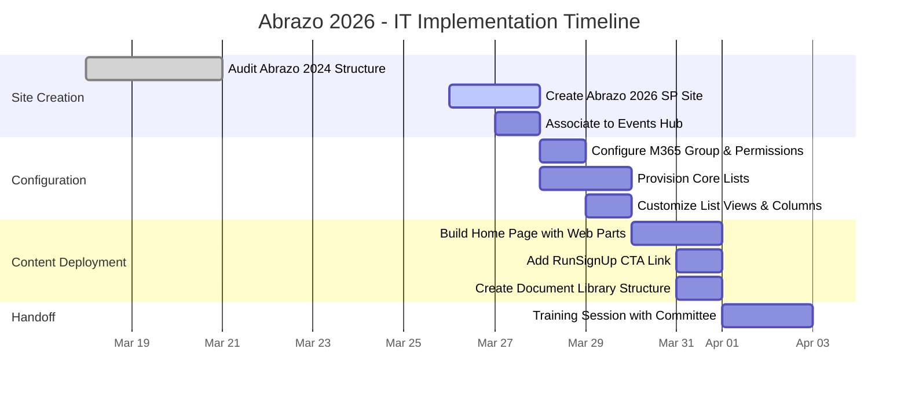
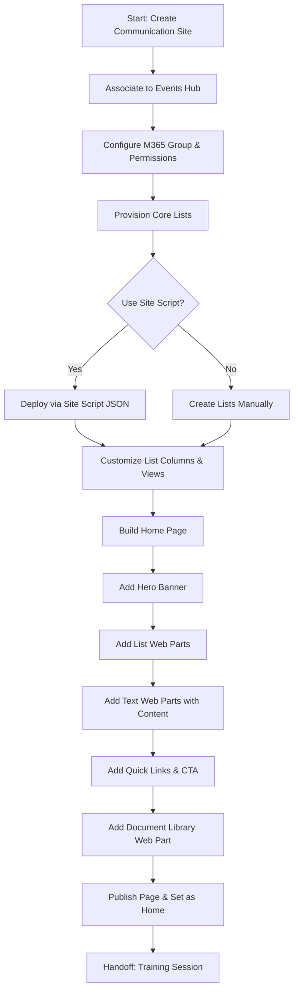
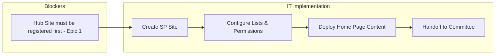

# Abrazo 2026 - SharePoint Site Implementation Plan

> [!NOTE]
> This plan covers **IT scope only** -- the SharePoint site creation, configuration, and deployment. Event coordination tasks (volunteers, sponsors, logistics) are managed by the event committee directly.

## Project Timeline

---

## Task Breakdown

### Phase 1: Site Creation (Sprint 1)

| # | Task | Priority | Status | Due |
|---|------|----------|--------|-----|
| 1 | Audit Abrazo 2024 SharePoint structure and permissions | High | Done | Mar 20 |
| 2 | Create "Abrazo 2026" Communication Site in SharePoint | High | To Do | Mar 28 |
| 3 | Associate Abrazo 2026 site to the Events Hub | High | To Do | Mar 28 |

### Phase 2: Configuration (Sprint 1)

| # | Task | Priority | Status | Due |
|---|------|----------|--------|-----|
| 4 | Configure M365 Group and permissions for Committee Members | Medium | To Do | Mar 30 |
| 5 | Provision core lists (Event Tasks, Roster, Budget, Risks) using Work Progress Tracker template | High | To Do | Mar 31 |
| 6 | Customize Category column with event-specific choices (see [[03-Event-Tasks-List-Design.md]]) | Medium | To Do | Mar 31 |
| 7 | Add custom columns (Phase, Week) to Event Tasks list | Low | To Do | Mar 31 |

### Phase 3: Content Deployment (Sprint 1)

| # | Task | Priority | Status | Due |
|---|------|----------|--------|-----|
| 8 | Build Home Page using modern web parts (Hero, Quick Links, List, Document Library) | High | To Do | Mar 30 |
| 9 | Paste event content into Text web parts (see [[01-SharePoint-Home-Page-Content.md]]) | Medium | To Do | Mar 31 |
| 10 | Add RunSignUp Call to Action link on Home Page | Low | To Do | Mar 31 |
| 11 | Create Document Library folder structure (Flyers, Contracts, Volunteer-Info, etc.) | Medium | To Do | Mar 31 |
| 12 | Publish page and set as Home Page | Medium | To Do | Mar 31 |

### Phase 4: Handoff (Sprint 2)

| # | Task | Priority | Status | Due |
|---|------|----------|--------|-----|
| 13 | Conduct SharePoint training session for committee members | Medium | To Do | Apr 3 |
| 14 | Create legacy folders for past Abrazo events (2024, etc.) | Low | To Do | Apr 7 |

---

## Workflow: SharePoint Site Deployment

---

## Key Dependencies

> [!WARNING]
> **Dependency**: If Epic 1 (Hub Site registration) is not completed first, the Abrazo 2026 site can still be created as a standalone Communication Site, but it will need to be manually re-associated to the Hub later.

---

## IT Milestones

| Date | Milestone |
|:----:|-----------|
| Mar 28 | SharePoint site created and associated to Hub |
| Mar 31 | Lists provisioned, permissions configured, Home Page live |
| Apr 3 | Committee training completed -- site handed off |

---

## JIRA Alignment

| JIRA ID | Story/Task | Sprint |
|---------|------------|--------|
| SP-US06 | Create Urgent Abrazo 2026 Site | Sprint 1 |

> [!NOTE]
> New sub-tasks may need to be created in JIRA for the Home Page setup and list configuration tasks (Tasks 4-12 above). Consider creating them under SP-US06.
