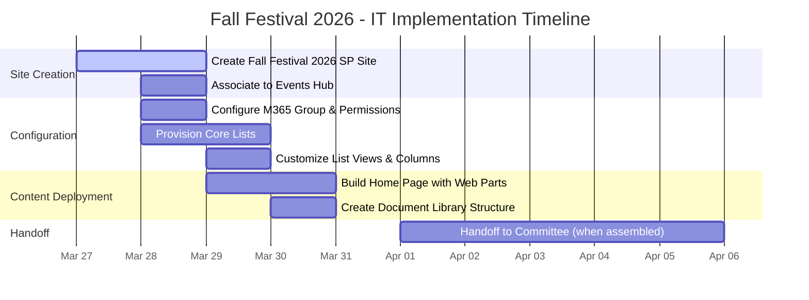
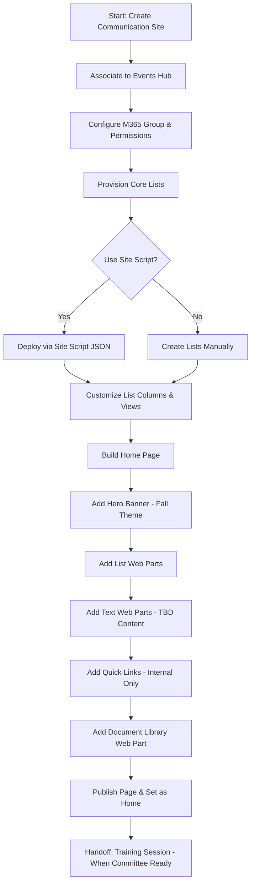
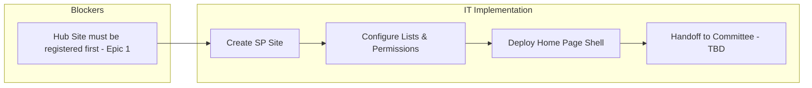

# Fall Festival 2026 - SharePoint Site Implementation Plan

> [!NOTE]
> This plan covers **IT scope only** -- the SharePoint site creation, configuration, and deployment. Event coordination tasks (vendors, volunteers, activities, logistics) are managed by the event committee directly.

> [!IMPORTANT]
> This is a **shell deployment** -- the SharePoint site structure is being set up now (Sprint 1) in anticipation of the event. Content details (schedule, activities, contacts) will be populated as the committee is assembled and planning progresses.

## Project Timeline

---

## Task Breakdown

### Phase 1: Site Creation (Sprint 1)

| # | Task | Priority | Status | Due |
|---|------|----------|--------|-----|
| 1 | Create "Fall Festival 2026" Communication Site in SharePoint | High | To Do | Mar 28 |
| 2 | Associate Fall Festival 2026 site to the Events Hub | High | To Do | Mar 28 |

### Phase 2: Configuration (Sprint 1)

| # | Task | Priority | Status | Due |
|---|------|----------|--------|-----|
| 3 | Configure M365 Group and permissions for Committee Members | Medium | To Do | Mar 30 |
| 4 | Provision core lists (Event Tasks, Roster, Budget, Risks) using Work Progress Tracker template | High | To Do | Mar 31 |
| 5 | Customize Category column with event-specific choices (see [[03-Event-Tasks-List-Design.md]]) | Medium | To Do | Mar 31 |
| 6 | Add custom columns (Phase, Week) to Event Tasks list | Low | To Do | Mar 31 |

### Phase 3: Content Deployment (Sprint 1)

| # | Task | Priority | Status | Due |
|---|------|----------|--------|-----|
| 7 | Build Home Page using modern web parts (Hero, Quick Links, List, Document Library) | High | To Do | Mar 30 |
| 8 | Paste event content into Text web parts (see [[01-SharePoint-Home-Page-Content.md]]) | Medium | To Do | Mar 31 |
| 9 | Create Document Library folder structure (Flyers, Vendor-Contracts, Permits, Volunteer-Info, etc.) | Medium | To Do | Mar 31 |
| 10 | Publish page and set as Home Page | Medium | To Do | Mar 31 |

### Phase 4: Handoff (Sprint 2+)

| # | Task | Priority | Status | Due |
|---|------|----------|--------|-----|
| 11 | Conduct SharePoint training session for committee members (when assembled) | Medium | To Do | TBD |

---

## Workflow: SharePoint Site Deployment

---

## Key Dependencies

> [!WARNING]
> **Dependency**: If Epic 1 (Hub Site registration) is not completed first, the Fall Festival 2026 site can still be created as a standalone Communication Site, but it will need to be manually re-associated to the Hub later.

---

## Key Differences from Abrazo 2026

| Area | Abrazo 2026 | Fall Festival 2026 |
|------|------------|-------------------|
| External registration | RunSignUp CTA link required | None -- free walk-in event |
| Pricing sections | 5K/10K pricing tables on home page | No pricing -- free admission |
| Course map | RunSignUp course map link | Not applicable |
| Content readiness | Full content ready at deployment | Shell only -- content TBD |
| Committee | Assembled, contacts known | Not yet assembled |

---

## IT Milestones

| Date | Milestone |
|:----:|-----------| 
| Mar 28 | SharePoint site created and associated to Hub |
| Mar 31 | Lists provisioned, permissions configured, Home Page shell live |
| TBD | Committee training completed -- site handed off |

---

## JIRA Alignment

| JIRA ID | Story/Task | Sprint |
|---------|------------|--------|
| TBD | Create Fall Festival 2026 Shell Site | Sprint 1 |

> [!NOTE]
> A new user story needs to be created in JIRA for the Fall Festival site deployment. Recommend creating under the SharePoint Events Portal project, similar to SP-US06 for Abrazo.
