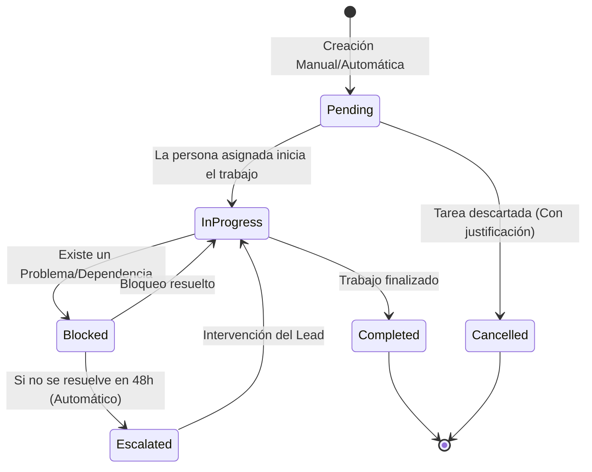
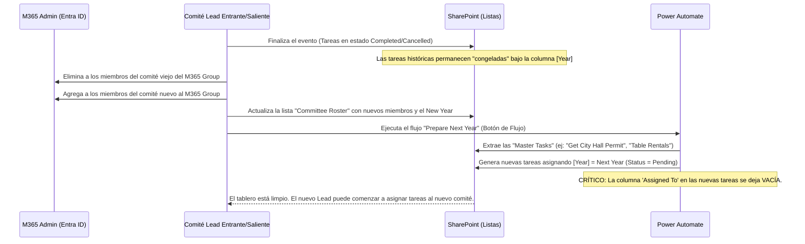
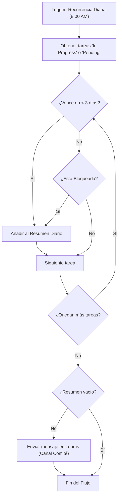

# Flujos de Trabajo y Ciclo de Vida del Evento (Extendido)

A continuación se presentan los diagramas de ciclo de vida con un enfoque profundo en el manejo de excepciones y el archivado robusto.

## 1. Ciclo de Vida de Tareas (Event Task)
Gestiona las asignaciones y los posibles cuellos de botella (bloqueos y escalaciones).

## 2. Proceso de Rollover Anual (Rotación de Comité y Archivados)
Dado que los comités cambian cada año, el rollover no puede simplemente asignar tareas a las mismas personas. El ciclo se centra en "limpiar responsabilidades" y despejar el tablero para el nuevo comité.

## 3. Flujo de Notificaciones y Acuerdo de Nivel de Servicio (SLA)
Para evitar la saturación de correos electrónicos, el flujo incorpora verificaciones de tiempo (Recurrencia Diaria) en Power Automate en lugar de notificaciones instantáneas para todo.

*Análisis Operativo:* Un Resumen Diario es infinitamente mejor para la *Gobernanza* que disparar un correo por cada elemento de lista creado. Ayuda a mantener la tranquilidad del comité y aumenta la probabilidad de que las alertas sean leídas y atendidas.
