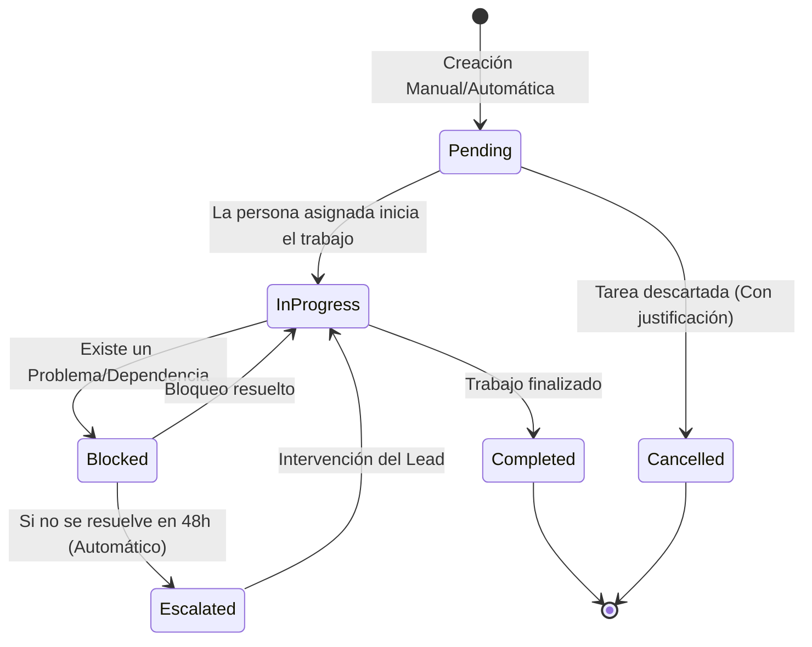
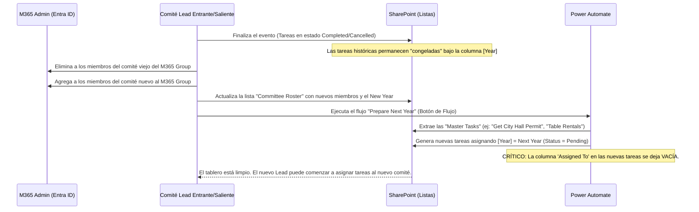
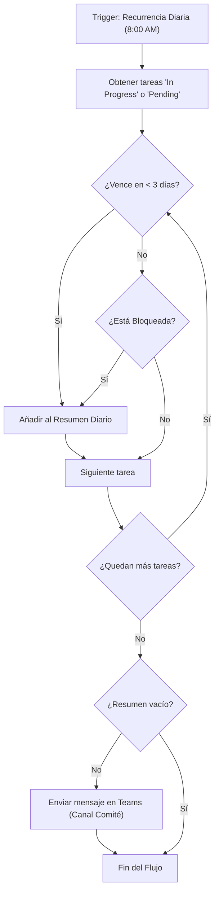

# Arquitectura General de SharePoint

## Resumen
La solución está estructurada utilizando un **Hub Site** principal para "Casa Familiar Events", al cual se asocian **sitios secundarios (Team Sites)** para cada evento específico.

## Estructura de Sitios
- **Hub Site:** `Casa Familiar Events Hub`
  - Sitios Asociados (Eventos):
    - `Fall Festival`
    - `Haunted House`
    - `Día de Muertos`
    - `Thanksgiving`
    - `Día de Reyes`

## Gestión de Comités y Permisos (Estrategia para Alta Rotación)
Dado que la rotación constante de los miembros del comité año tras año es una realidad, la gestión de identidad es la pieza central de esta arquitectura.
- Cada sitio de evento tendrá un **Microsoft 365 Group** único y persistente.
- **Onboarding/Offboarding Centralizado:** La rotación anual se gestiona **exclusivamente** agregando o eliminando miembros del grupo M365 a través de Entra ID o el Admin Center.
  - *Ventaja clave:* Al dejar un comité, el voluntario pierde instantáneamente el acceso a correos, calendarios y archivos logísticos confidenciales para el próximo año.
  - *Riesgo mitigado:* No se crean "grupos huérfanos" (ej: "Comité 2023", "Comité 2024"). Es un solo grupo que muta sus miembros.
- **Roles y Gobernanza:**
  - **Site Owners (Leads):** 2 personas. Tienen control total sobre las listas, flujos y permisos de su sub-sitio. Son responsables de "Cerrar" el año.
  - **Site Members (Comité):** ~8 personas. Pueden agregar, editar y completar tareas en las listas de su evento. No pueden borrar elementos ni borrar Vistas (se debe configurar el nivel de permiso *Contribute* sin *Delete* para proteger la auditoría).
  - **Site Visitors:** Empleados o voluntarios que solo necesitan ver el progreso (Solo lectura).
  - **External Sharing:** Debe estar bloqueado o restringido para asegurar que las minutas, bases de datos o contratos permanezcan accesibles solo para el personal interno.

## Unificación y Mantenibilidad (Enfoque de Desarrollo)
Para lograr la mantenibilidad requerida por un perfil técnico (Developer) y unificar los sitios:
1. **Configuración del Hub Site:** La navegación principal, el branding y los permisos globales (si aplica) se gestionan desde el Hub.
2. **Site Templates / Site Scripts (JSON):** 
   - Crear un esquema de sitio base usando JSON/PowerShell que contenga todas las listas requeridas. Al aplicar esta plantilla a cualquier evento nuevo o existente, las listas estándar se generarán o actualizarán automáticamente.
   - *Consideración profunda:* Esto permite que en el futuro, si se agrega un nuevo evento (ej: "Posada Navideña"), lanzar el portal tome 5 minutos y respete exactamente las mismas columnas.
3. **Site Columns y Content Types:** Definirlos a nivel de Hub y publicarlos en los sitios secundarios (Content Type Hub) para que todas las listas de eventos compartan exactamente los mismos nombres internos e IDs de esquema (ej: `Task Status`, `Event Year`). Esto es crucial para el cruce de datos (Roll-up) y consolidaciones en PowerBI.
# Estructura de Listas y Contenido (Detalle Profundo)

Para mantener la estandarización y evitar diferencias entre los sitios de eventos, cada sub-sitio de evento contendrá las siguientes listas. Todas deben usar Content Types definidos en el Hub.

## 1. Lista: Event Tasks
Lista principal para el seguimiento de actividades.

| Column | Data Type | Description / Options | Advanced Configuration |
| :--- | :--- | :--- | :--- |
| **Title** | Text | Nombre de la tarea. | Requerido |
| **Description** | Multiple lines text | Detalles de la responsabilidad. | Rich Text habilitado |
| **Assigned To** | Person or Group | Persona asignada. | Restringido al M365 Group del sitio |
| **Status** | Choice | `Pending`, `In Progress`, `Blocked`, `Completed`, `Cancelled`. | Default: `Pending`. Formato Condicional (Rojo/Amarillo/Verde) |
| **Year (Cycle)** | Choice (o Number) | Año al que pertenece (ej: `2024`). | Indexado. Requerido. |
| **Start Date** | Date and Time | Cuándo debe comenzar la tarea. | Friendly Format |
| **Due Date** | Date and Time | Fecha límite o de finalización. | Validación: Mayor a Start Date |
| **Closing Notes** | Multiple lines text | Lecciones aprendidas. | - |
| **Lead Approval** | Yes/No | Check para tareas críticas. | Visible solo a Owners o vía validación de lista. |

*Análisis Profundo:* Indexar la columna `Year (Cycle)` es esencial cuando la lista supera los 5,000 elementos (eventos a largo plazo), asegurando que las Vistas activas no se rompan (límite de Threshold de SharePoint).

## 2. Lista: Committee Roster (Roles y Miembros)
Lista para registrar quién participó en qué rol en cada comité anual.

| Column | Data Type | Description / Options | Advanced Configuration |
| :--- | :--- | :--- | :--- |
| **Title (Name)** | Person or Group | Usuario de M365 perteneciente al comité. | Mostrar foto de perfil |
| **Committee Role**| Choice | `Lead`, `Member`. | - |
| **Area/Department**| Choice | `Logistics`, `Marketing`, `Volunteering`. | Permite crear vistas de directorio precisas |
| **Year** | Choice / Number | Año de participación (ej: `2024`). | - |

## 3. Lista: Risks & Issues (Registro de Riesgos)
Los eventos a menudo sufren contratiempos imprevistos no considerados tareas normales. Separar esto de 'Event Tasks' permite medir el nivel de salud del proyecto.

| Column | Data Type | Description / Options |
| :--- | :--- | :--- |
| **Risk/Issue** | Text | Ej: "Faltan permisos del Ayuntamiento" |
| **Impact** | Choice | `High`, `Medium`, `Low` |
| **Mitigation Plan**| Multiple lines | Qué se hará al respecto. |
| **Status** | Choice | `Open`, `Resolved` |
| **Year** | Choice / Number | Año |

## 4. Document Library: Event Documents
Estructura unificada que asegura la Retention Policy.

- *Folder:* `/2023/`
- *Folder:* `/2024/`
  - *Folder:* `/2024/Committee Minutes/`
  - *Folder:* `/2024/Contracts and Permits/`
  - *Folder:* `/2024/Invoices/`

*Análisis de Integridad:* Se sugiere obligar el Control de Versiones en esta biblioteca para evitar sobreescrituras accidentales de contratos, y aplicar *Retention Labels* nativos desde el Compliance Center para que "Contracts and Permits" no puedan borrarse por al menos 5 años (para auditoría fiscal de Non-Profit).
# Flujos de Trabajo y Ciclo de Vida del Evento (Extendido)

A continuación se presentan los diagramas de ciclo de vida con un enfoque profundo en el manejo de excepciones y el archivado robusto.

## 1. Ciclo de Vida de Tareas (Event Task)
Gestiona las asignaciones y los posibles cuellos de botella (bloqueos y escalaciones).



## 2. Proceso de Rollover Anual (Rotación de Comité y Archivados)
Dado que los comités cambian cada año, el rollover no puede simplemente asignar tareas a las mismas personas. El ciclo se centra en "limpiar responsabilidades" y despejar el tablero para el nuevo comité.



## 3. Flujo de Notificaciones y Acuerdo de Nivel de Servicio (SLA)
Para evitar la saturación de correos electrónicos, el flujo incorpora verificaciones de tiempo (Recurrencia Diaria) en Power Automate en lugar de notificaciones instantáneas para todo.


*Análisis Operativo:* Un Resumen Diario es infinitamente mejor para la *Gobernanza* que disparar un correo por cada elemento de lista creado. Ayuda a mantener la tranquilidad del comité y aumenta la probabilidad de que las alertas sean leídas y atendidas.
# Guía Maestra de Implementación: Sistema "Casa Familiar Events"

Esta es la guía definitiva para implementar y administrar el ecosistema de sitios de eventos. El sistema está diseñado en la **Experiencia Moderna de SharePoint** (Modern Experience).

---

## Prerrequisitos de Automatización (Septiembre 2024)
Antes de ejecutar cualquier script (`.ps1`) o subir archivos JSON, tienes dos opciones según tu preferencia:

### Opción A: Módulo Oficial de SharePoint (SPO)
*   **Uso:** Ideal para registrar el Site Script (JSON) de forma "oficial".
*   **Fácil:** No requiere registrar aplicaciones de terceros.
*   **Guía:** **[[04j-Official-SPO-Deployment|Ver pasos con el módulo oficial aquí]]**.

### Opción B: PnP PowerShell (Recomendado para Expertos)
*   **Uso:** Necesario para crear carpetas, menús complejos y automatización de contenido.
*   **Poderoso:** Mucho más flexible pero requiere el registro de Entra ID.
*   **Guía:** **[[04e-Detalle-Site-Scripts|Ver pasos con PnP aquí]]**.

---

## Fase 1: Configuración del Hub (The "Brain")
*Esta fase se realiza manualmente por única vez en el sitio principal.*

1.  **Crear el Hub Site:**
    *   Nombre: `Event Planning Improvements Project` (o el nombre de tu Hub).
    *   Registrarlo como **Hub Site** en el Centro de Administración de SharePoint.
2.  **Columnas de Sitio (The Metadata):**
    *   Define las 3 columnas maestras en el Hub para que todos los eventos hablen el mismo idioma.
    *   **[[04a-Detalle-Columnas-Base|Ver configuración exacta de columnas aquí]]**
3.  **Políticas de Cumplimiento (Compliance):**
    *   Configura las reglas para que los contratos y actas no se borren por error.
    *   **[[04d-Detalle-Retention-Policies|Ver configuración de Retención]]**
4.  **Estructura de Archivos y Menú:**
    *   Configura las bibliotecas de "Master Templates" y el "MegaMenu" en inglés.
    *   **[[08-Hub-Site-English-Content|Ver blueprint del Hub y Menú]]**
    *   **[[09-Event-Site-Folder-Structure|Ver estructura operativa para Sitios de Eventos]]**
    *   **Automatización:** Usa `create-hub-folders.ps1` para el Hub y `create-event-folders.ps1` para cada sitio nuevo.

---

## Fase 2: Automatización de Sitios (The "Blueprint")
*Usa plantillas (Site Scripts) para crear sitios de eventos en 2 minutos.*

1.  **El Molde Maestro (JSON):**
    *   Usa la versión "Ultimate" que ya tiene todos los campos de Tareas, Presupuesto, Riesgos y Roster configurados.
    *   **[[04h-Site-Script|Instrucciones de Despliegue del Script V5]]**
2.  **Registro del Tema (Branding):**
    *   Asegúrate de registrar el tema "Teal" para que los sitios se vean profesionales. (Instrucciones dentro de la guía de Site Scripts arriba).

---

## Fase 3: Gobierno y Continuidad (The "Control")
*Cómo mantener el orden a través de los años.*

1.  **Plan de Gobernanza:**
    *   Reglas sobre quién puede editar qué y cuándo los sitios pasan a modo "Solo Lectura".
    *   **[[05-Plan-Gobernanza-Datos|Plan de Gobernanza de Datos]]**
2.  **Estrategia de Reutilización:**
    *   ¿Crear sitio nuevo o limpiar el viejo? (Pista: Siempre es mejor uno nuevo).
    *   **[[06-Estrategia-Reutilizacion-Anual|Plan de Reutilización Anual]]**
3.  **Gestión Centralizada de Archivos:**
    *   Cómo fluyen las plantillas desde el Hub hacia los sitios de eventos.
    *   **[[07-Estrategia-Archivos-Centralizados|Estrategia de Documentos]]**

---

## Fase 4: Visualización y Formato (The "Look")
*Haz que la información sea fácil de consumir para los voluntarios.*

1.  **Formato de Colores (JSON):**
    *   Códigos para que el estatus "Blocked" sea rojo y "Completed" verde automáticamente.
    *   **[[04b-JSON-Formatting-Templates|Ver códigos de formato visual]]**
2.  **Diseño de Páginas:**
    *   Cómo acomodar los elementos en la página principal para que el comité vea sus tareas al entrar.
    *   **[[04f-Detalle-Visualizacion-Paginas|Ver guía de diseño de páginas]]**

---

## Fase 5: Futuras Mejoras (Native Power)
Para el futuro, considera usar herramientas nativas para extender la funcionalidad:
*   **[[05-Future-Native-Improvements|Ver ideas de automatización con Power Automate]]**

---
# Plan de Implementación del Sitio (Extendido)

Este plan cubre todo desde la configuración inicial hasta el plan de gobernanza y adopción de usuarios (Change Management).

> [!NOTE] 
> **¿Requiere Desarrollo?**
> El grueso de esta arquitectura es **Configuración Out-of-the-Box (OOTB)** (haciendo clic en la interfaz de SharePoint).
> NO se requiere programación tradicional (como React o C#). 
> Sin embargo, incluye ligeras cargas de **Low-Code/Scripting** (marcadas con la etiqueta [LOW-CODE]) en dos áreas: 
> 1. Power Automate: Para conectar flujos lógicos (arrastrar y soltar bloques condicionales).
> 2. JSON/PnP PowerShell: Para automatizar la creación de sitios en lugar de hacerlo de forma manual e iterativa.

## Fase 1: Arquitectura de Hub y Gobernanza (Data Governance)
- [ ] **1.1. Crear Hub Site:** Crear un Communication Site ("Casa Familiar Events") y registrarlo. [CONFIGURATION]
- [ ] **1.2. Site Columns (Nivel Hub):** Crear tipos de datos CF_TaskStatus, CF_YearCycle, CF_CommitteeRole. [CONFIGURATION]
- [ ] **1.3. Content Types (Nivel Hub):** Agrupar Site Columns en Event Task CT y Roster CT, y publicarlos (Content Type Publisher). [CONFIGURATION]
- [ ] **1.4. Retention Policies (Compliance Center):** Aplicar políticas de auditoría a las bibliotecas de documentos (vida útil obligatoria de 5 años para contratos). [CONFIGURATION]

## Fase 2: Automatización del Despliegue de Sitios (Desarrollo Ligero)
- [ ] **2.1. Plantilla (Site Script & Site Design):** [LOW-CODE] Desarrollar scripts JSON y PnP PowerShell que instalen automáticamente las listas (Event Tasks, Risks, Committee Roster, Event Budget) sobre los grupos de M365 creados.
- [ ] **2.2. Aprovisionamiento:** [LOW-CODE] Ejecutar el Site Design en los 5 sitios base (Fall Festival, Haunted House...). Esto elimina errores tipográficos al escribir columnas manualmente.

## Fase 3: Configuración de Interfaz y Vistas Nativas
- [ ] **3.1. Formato de Vistas (List Formatting):** [LOW-CODE] Aplicar JSON Formatters (código JSON nativo de SharePoint) para colorear toda la fila de verde si está Completed o de rojo grueso si está Blocked.
- [ ] **3.2. Vistas Indexadas:** Crear un índice a nivel de plataforma para la columna CF_YearCycle para prevenir el colapso del sitio a largo plazo (List Threshold de 5,000 elementos). [CONFIGURATION]
- [ ] **3.3. Hub Central Dashboard:** Configurar Highlighted Content Webparts en el Hub central para mostrar "Tareas Bloqueadas Recientes". [CONFIGURATION]

## Fase 4: Flujos Operativos y Notificaciones (Plumbing / Flow)
- [ ] **4.1. Resumen Diario de Vencimientos:** [LOW-CODE] Programar el "Daily Digest" en Power Automate para verificar tareas vencidas.
- [ ] **4.2. Flujo de Rollover Automático:** [LOW-CODE] Crear el flujo maestro que clona tareas críticas del ciclo anterior y prepara al nuevo comité.

## Fase 5: Estrategia de Adopción (Change Management)
- [ ] **5.1. Piloto Técnico (UAT):** Probar los flujos con usuarios ficticios en 1 sitio o con el equipo técnico.
- [ ] **5.2. Playbook / Manual del Comité:** Crear una WIKI o página dentro del Hub Site llamada "Cómo gestionar mi evento" (capacitación asíncrona para la rotación constante de voluntarios).
- [ ] **5.3. Limitación de Daños (Permisos):** Validar que los permisos para el Committee Roster no permitan borrar la lista completa. (Cambiar nivel Contributor -> Nivel de permiso personalizado sin capacidad de borrar listas/elementos).
- [ ] **5.4. Go-Live y Soporte Temprano:** Incorporar a los comités reales del año actual e iniciar el soporte de hypercare por 2 a 3 semanas.
# Detalle Técnico: Columnas de Sitio (Modern SharePoint)

> [!NOTE]
> En la interfaz moderna (**Modern Experience**), algunas configuraciones avanzadas aún requieren acceder al panel de *Site Settings* tradicional, pero la aplicación de estas columnas a las listas es 100% moderna.

### 1. ¿Qué son las "Site Columns"?
**No son listas.** Imagínalas como los "encabezados" o "categorías" que utilizarás más adelante dentro de tus listas.

*   **Una Lista** es como una hoja de Excel (ej: "Lista de Tareas").
*   **Una Site Column** es la definición del campo (ej: "Estado") que vive al nivel del sitio para que puedas usarlo en muchas hojas de Excel diferentes sin tener que volver a crearlo.

En SharePoint, una **Site Column** es una definición de columna reutilizable. A diferencia de una columna de lista estándar, si cambias la configuración de una Site Column (ej: agregas una nueva opción de estado), el cambio puede propagarse automáticamente a todas las listas que la utilizan.

### 2. Configuración de las 3 Columnas Maestras (Paso a Paso)

> [!IMPORTANT]
> **Ubicación:** Ve siempre a tu **HUB SITE** primero.
> Haz clic en el icono del engrane (**Settings** -> **Site information** -> **View all site settings** -> **Site columns** -> **Create**.

---

#### A. Columna: `CF_TaskStatus`
*   **Nombre de columna:** `CF_TaskStatus`
*   **Tipo:** `Choice (menú para elegir)`
*   **Grupo:** `New group` -> `_Casa Familiar`
*   **Descripción:** `Estandarizar el progreso de las tareas.`
*   **Requerir que esta columna contenga información:** `Sí` (Importante: cada tarea debe tener un estado).
*   **Forzar valores únicos:** `No`
    ```text
    1. Pending
    2. In Progress
    3. Blocked
    4. Completed
    ```
*   **Permitir opciones 'Fill-in':** `No` (Crítico: permitir estados personalizados rompe la automatización de tareas).
*   **Mostrar opciones usando:** `Drop-Down Menu`
*   **Valor por defecto:** `1. Pending`

---

#### B. Columna: `CF_YearCycle`
*   **Nombre de columna:** `CF_YearCycle`
*   **Tipo:** `Choice (menú para elegir)`
*   **Grupo:** `Existing group` -> `_Casa Familiar`
*   **Descripción:** `Ciclo anual del evento (ej: 2025).`
*   **Requerir que esta columna contenga información:** `Sí` (Importante para el seguimiento histórico).
*   **Opciones:**
    ```text
    2024
    2025
    2026
    2027
    ```
*   **Permitir opciones 'Fill-in':** `Sí` (Importante: permite agregar años futuros sin editar la configuración).
*   **Mostrar opciones usando:** `Drop-Down Menu`
*   **Valor por defecto:** `Choice` -> (Dejar vacío o seleccionar el año actual).

---

#### C. Columna: `CF_CommitteeRole`
*   **Nombre de columna:** `CF_CommitteeRole`
*   **Tipo:** `Choice (menú para elegir)`
*   **Grupo:** `Existing group` -> `_Casa Familiar`
*   **Descripción:** `Rol dentro del comité del evento.`
*   **Requerir que esta columna contenga información:** `No` (Opcional, ya que algunas tareas podrían no estar asignadas a un rol específico aún).
*   **Opciones:**
    ```text
    Event Lead
    Logistics
    Finance / Treasury
    Volunteer Management
    Communication / Marketing
    ```
*   **Permitir opciones 'Fill-in':** `Sí` (Útil si surge un nuevo rol en el comité durante el año).
*   **Mostrar opciones usando:** `Drop-Down Menu`
*   **Valor por defecto:** (Dejar vacío).

### 3. Ventajas de este Enfoque
1.  **Mantenimiento Centralizado:** Si el comité decide agregar un estado llamado "En Revisión", solo lo agregas en un lugar.
2.  **Reportes Consolidados:** Al usar exactamente el mismo nombre de columna y opciones.
3.  **Visualización Pro:** Puedes aplicar [[04b-JSON-Formatting-Templates|Formatos JSON avanzados]] para que las listas sean fáciles de leer.

---

### Recursos Adicionales
*   [[04b-JSON-Formatting-Templates|Manual de Códigos JSON para Formato de Columnas]]
# JSON Formatting Templates

Estos códigos se pegan en la sección **"Column Formatting"** (al final de la pantalla de creación de la columna) o seleccionando la columna en la lista -> **Column settings** -> **Format this column**.

### 1. [[CF_TaskStatus_Formatting|JSON para CF_TaskStatus (Estado)]]
Este JSON crea burbujas de color con texto en blanco para visibilidad inmediata.

```json
{
  "$schema": "https://developer.microsoft.com/json-schemas/sp/v2/column-formatting.schema.json",
  "elmType": "div",
  "txtContent": "@currentField",
  "style": {
    "padding": "4px 10px",
    "border-radius": "16px",
    "color": "white",
    "font-weight": "600",
    "text-align": "center",
    "background-color": "=if(@currentField == '1. Pending', '#607d8b', if(@currentField == '2. In Progress', '#0078d4', if(@currentField == '3. Blocked', '#d13438', if(@currentField == '4. Completed', '#107c10', '#f3f2f1'))))"
  }
}
```

---

### 2. [[CF_YearCycle_Formatting|JSON para CF_YearCycle (Año)]]
Muestra el año en una etiqueta sutil con borde.

```json
{
  "$schema": "https://developer.microsoft.com/json-schemas/sp/v2/column-formatting.schema.json",
  "elmType": "div",
  "txtContent": "@currentField",
  "style": {
    "padding": "2px 8px",
    "border": "1px solid #0078d4",
    "border-radius": "4px",
    "color": "#0078d4",
    "font-weight": "500",
    "display": "inline-block"
  }
}
```

---

### 3. [[CF_CommitteeRole_Formatting|JSON para CF_CommitteeRole (Rol)]]
Etiquetas tipo "pill" con colores suaves por rol.

```json
{
  "$schema": "https://developer.microsoft.com/json-schemas/sp/v2/column-formatting.schema.json",
  "elmType": "div",
  "txtContent": "@currentField",
  "style": {
    "padding": "4px 8px",
    "border-radius": "8px",
    "background-color": "=if(@currentField == 'Event Lead', '#edebe9', if(@currentField == 'Finance / Treasury', '#fff4ce', if(@currentField == 'Logistics', '#dff6dd', if(@currentField == 'Volunteer Management', '#d1e4fe', '#f3f2f1'))))",
    "color": "#323130",
    "font-size": "12px",
    "font-weight": "500"
  }
}
```
# Detalle Técnico: Content Types (Plantillas de Listas)

### 1. ¿Qué es un "Content Type"?
Si las **Site Columns** son los ingredientes, el **Content Type** es la "receta". Es una plantilla que agrupa varias columnas para que puedas aplicarlas a una lista de un solo golpe.

---

### 2. Instrucciones para Crear el Content Type

Para ambos, ve a: **Settings** (Engranaje) -> **Site information** -> **View all site settings** -> **Site content types** -> **Create content type**.

#### A. Content Type: `Event Task CT` (Para Tareas)
Llena los campos exactamente así:

*   **Name:** `Event Task CT`
*   **Description:** `Plantilla maestra para las tareas de los eventos de Casa Familiar.`
*   **Category:** Selecciona **"New category"** y escribe `_Casa Familiar` (Para que aparezca junto a tus columnas).
*   **Parent content type:**
    *   **Parent category:** `List Content Types`
    *   **Content type:** `Item` (Es la base más limpia para construir listas personalizadas).

---

#### B. Content Type: `Roster CT` (Para el Comité)
Llena los campos exactamente así:

*   **Name:** `Roster CT`
*   **Description:** `Plantilla maestra para el listado de personas y roles del comité.`
*   **Category:** Selecciona **"Existing category"** -> `_Casa Familiar`.
*   **Parent content type:**
    *   **Parent category:** `List Content Types`
    *   **Content type:** `Item`.

---

### 3. El Paso Final: Agregar tus Columnas
Una vez que le des a **Create**, SharePoint te llevará a la pantalla del nuevo Content Type. Haz lo siguiente para terminar la "receta":

1.  Haz clic en **Add site column** (o *Add from existing site columns*).
2.  Busca tu grupo `_Casa Familiar`.
3.  Agrega las columnas correspondientes:
    *   Para `Event Task CT`: Agrega `CF_TaskStatus` y `CF_YearCycle`.
    *   Para `Roster CT`: Agrega `CF_CommitteeRole` y `CF_YearCycle`.

### 📂Relacionado
*   [[04a-Detalle-Columnas-Base|Guía de Columnas (Ingredientes)]]
*   [[04-Guia-Implementacion-Practica|Volver a la Guía Principal]]
# Detalle Técnico: Retention Policies (Microsoft Purview)

### 1. ¿Qué es una Retention Policy?
Es una regla de cumplimiento que vive por encima de SharePoint, en el **Microsoft Purview (Compliance Center)**. Sirve para asegurar que la información importante no se pierda, ya sea por error humano o de forma intencionada.

En tu proyecto, los **contratos y presupuestos** son críticos. Una política de retención garantiza que, aunque alguien intente borrar un archivo, SharePoint guardará una copia oculta durante el tiempo que definas.

---

### 2. Configuración en Microsoft Purview

Para configurar esto, un administrador debe ir a: **Microsoft 365 Admin Center** -> **Compliance** (o Purview) -> **Data Lifecycle Management** -> **Microsoft 365** -> **Retention Policies**.

#### Configuración Recomendada para Casa Familiar:
*   **Name:** `Retention Policy - Event Contracts (5 Years)`
*   **Description:** `Retención obligatoria para documentos de contratos y finanzas de eventos.`
*   **Type:** **Static** (Para aplicar a sitios específicos).
*   **Locations:** Selecciona **SharePoint sites**. Puedes elegir aplicarlo a todos los sitios o solo a los que pertenecen al Hub de eventos.
*   **Retention Settings:**
    *   **Retain items for a specific period:** `5 years`.
    *   **Start the retention period based on:** `When items were created`.
    *   **At the end of the retention period:** `Do nothing` (o borrar automáticamente si quieres limpieza total).

---

### 3. ¿Cómo funciona en la vida real?
Si un usuario intenta borrar un contrato bajo esta política:

1.  El archivo parece desaparecer de la biblioteca de documentos.
2.  Sin embargo, SharePoint lo mueve automáticamente a una biblioteca oculta llamada **"Preservation Hold Library"**.
3.  Solo los administradores con permisos especiales pueden ver o recuperar esos archivos de esa biblioteca oculta durante los 5 años que dura la política.

### 4. Diferencia entre "Retention Policy" y "Retention Label"
*   **Policy (Política):** Se aplica a **todo el sitio** o biblioteca. Es automática y el usuario no tiene que hacer nada. *(Esta es la recomendada para tu Fase 1).*
*   **Label (Etiqueta):** El usuario elige manualmente qué archivos marcar (ej: marcar solo el archivo "Contrato.pdf"). Es más flexible pero requiere que la gente se acuerde de poner la etiqueta.

### 📂 Relacionado
*   [[04-Guia-Implementacion-Practica|Volver a la Guía Principal]]
# 04e - Guía de Despliegue de Site Scripts (v3+)

Esta guía explica cómo registrar y aplicar los Site Scripts (`event-site-template.json` y `hub-site-template.json`) utilizando los estándares más recientes de PnP PowerShell (Posteriores a Septiembre 2024).

## 1. Prerrequisitos (PowerShell 7)

Microsoft actualizó las políticas de seguridad en Septiembre 2024. Ahora debes registrar tu propia aplicación en tu tenant para permitir los inicios de sesión interactivos.

### 1.1 Registrar la App de PnP en Entra ID
Ejecuta este comando una sola vez por tenant:
```powershell
Register-PnPEntraIDAppForInteractiveLogin
```
- Se abrirá una ventana del navegador. Inicia sesión con tu cuenta de administrador.
- Concede el consentimiento para la organización.
- IMPORTANTE: En tu terminal de PowerShell, aparecerá un Application (Client) ID. Cópialo y guárdalo.

## 2. Conectar a SharePoint

Una vez registrado, conéctate usando tu nuevo Client ID:
```powershell
$SiteURL = "https://netorg4878279.sharepoint.com/sites/TuSitio"
$ClientID = "TU-CLIENT-ID-AQUI"

Connect-PnPOnline -Url $SiteURL -Interactive -ClientId $ClientID
```

## 3. Registrar el Site Script

Para agregar tu JSON como una plantilla en SharePoint:

```powershell
# Leer el archivo JSON
$json = Get-Content -Path ".\event-site-template.json" -Raw

# Agregar el Site Script a SharePoint
Add-PnPSiteScript -Title "Casa Familiar - Event Site Template" -Content $json -Description "Listas estandarizadas para planeación de eventos"
```
Toma nota del ID devuelto por este comando.

## 4. Crear el Site Design (Plantilla de Sitio)

Ahora, vincula ese script a un "Site Design" para que aparezca en la interfaz web:

```powershell
Add-PnPSiteDesign -Title "Event Planning Site" -SiteScriptIds "EL-ID-DEL-PASO-3" -WebTemplate "64"
```
Nota: "64" es el ID para un Team Site.

## 5. Aplicación Visual (Interfaz Web)

Una vez registrado vía PowerShell, puedes aplicarlo visualmente:
1. Ve a tu nuevo sitio de SharePoint.
2. Haz clic en Settings (Icono del engrane) -> Apply a site template.
3. Ve a la pestaña From your organization.
4. Selecciona "Event Planning Site" y haz clic en Use template.

---
> [!TIP]
> Usa `Get-PnPSiteScript` y `Get-PnPSiteDesign` para listar las plantillas ya registradas.
# Detalle Técnico: Visualización en Páginas (Web Parts)

### 1. La Diferencia entre Lista y Página
*   **La Lista:** Es el "depósito" de datos. Es donde entras a escribir las tareas, elegir el año y ver los colores. (Ej: `https://tu-sitio/Lists/EventTasks`).
*   **La Página:** Es la "cara" del sitio. Es lo que los usuarios ven al entrar (Home). Aquí es donde **muestras** la lista de forma elegante.

---

### 2. Cómo agregar tus Columnas Maestras a una Lista
Si ya tienes una lista creada y quieres empezar a usar tus columnas (Status, Year, Role), sigue esta ruta para no tener que crearlas de nuevo:

1.  Entra a la lista en SharePoint.
2.  Haz clic en el engrane (Settings) -> List settings.
3.  Baja a la sección Columns y haz clic en Add from existing site columns.
4.  En "Select columns from", elige tu grupo _Casa Familiar.
5.  Selecciona la columna, dale a Add > y luego a OK.

---

### 3. Cómo mostrar tu lista en la Página Principal (Home)
Para que el comité vea sus tareas al entrar al sitio:
1. Ve a la página de inicio (Home) y haz clic en Edit (esquina superior derecha).
2. Haz clic en el círculo con el símbolo de más (+) para agregar un nuevo web part.
3. Busca y selecciona el web part de List.
4. Selecciona la lista de tareas (ej: Event Tasks).
5. Haz clic en Republish para guardar los cambios.

---

### 4. Personalizar la vista en la Página
Una vez que la lista está en la página, puedes:
*   **Filtrar:** Configurar el componente para que solo muestre las tareas "Blocked".
*   **Esconder columnas:** Para que la página no se vea muy cargada, puedes esconder la columna "ID" o "Creado por" y dejar solo lo importante.

### 5. Resumen Visual
*   **¿Dónde vive la columna?** En la Lista.
*   **¿Dónde se ve el Dashboard?** En la Página (usando el Web Part de Lista).

### Relacionado
*   [[04b-JSON-Formatting-Templates|Asegúrate de tener aplicados los colores JSON para que la página sea impactante.]]
*   [[04-Guia-Implementacion-Practica|Volver a la Guía Principal]]
# Detalle Técnico: Ultimate Site Script (V5 - Final)

Esta es la versión **lista para producción** de tu automatización de gestión de eventos. Cada lista está completamente equipada, los enlaces de navegación están preconfigurados y el branding se aplica automáticamente.

---

### 1. Qué Incluye

| List | Columns | Smart View |
| :--- | :--- | :--- |
| **Event Tasks** | Status, Year, Due Date, Start Date, Assigned To, Priority, Category, % Complete, Notes | "My Pending Tasks", "Blocked Tasks" |
| **Risks** | Status, Risk Category, Probability, Impact Level, Mitigation Plan, Risk Owner, Review Date | "Active Risks" |
| **Committee Roster** | Role, Year, Phone, Email, Availability, Emergency Contact, Special Skills | — |
| **Event Budget** | Expense Category, Vendor, Estimated Cost, Actual Cost, Payment Status, Approved By, Invoice Date, Receipt Notes | "Pending Payments" |

**Plus:** Tema Teal + Navegación MegaMenu + Enlaces en el menú izquierdo.

---

### 2. Post-Despliegue: Convertir Campos de Texto a Choice

Después de aplicar el script, mejora manualmente estos campos para un mejor control de datos:

| List | Field | Recommended Choices |
| :--- | :--- | :--- |
| Event Tasks | Priority | High, Medium, Low |
| Event Tasks | Category | Venue, Catering, Entertainment, Marketing, Logistics |
| Risks | Probability | Low, Medium, High |
| Risks | Impact Level | Low, Medium, High, Critical |
| Event Budget | Payment Status | Pending, Approved, Paid, Cancelled |
| Event Budget | Expense Category | Venue Rental, Food & Beverage, Decorations, Permits, Insurance, Marketing |
| Committee Roster | Availability | Full-Time, Part-Time, Event Day Only |

**Cómo:** List Settings → clic en el nombre de la columna → cambiar Type a Choice → agregar opciones → OK.

---

### 3. Cómo Desplegar (Estrategia de Script Dual)

Dado que ahora tienes una arquitectura con un Hub central y múltiples Sitios de Eventos conectados, tienes **dos scripts JSON diferentes**.

#### A. Desplegando el Hub Site Script (`hub-site-template.json`)
Este script solo debe ejecutarse **una vez** en tu portal principal. Fuerza el tema Teal y establece el layout a MegaMenu con cabecera compacta.

**Importante:** Antes de ejecutar estos comandos, asegúrate de haber seguido la **[[04e-Detalle-Site-Scripts|Nueva Guía de Autenticación]]** para registrar tu Client ID.

```powershell
# Conectar usando PnP (Moderno)
Connect-PnPOnline -Url https://netorg4878279.sharepoint.com/sites/TuHub -Interactive -ClientId "TU-ID"

$hubContent = Get-Content ".\hub-site-template.json" -Raw
$hubResult = Add-PnPSiteScript -Title "Casa Familiar - Hub Branding" -Content $hubContent
Add-PnPSiteDesign -Title "Apply Hub Branding" -SiteScriptIds $hubResult.Id -WebTemplate "68"
```
*Aplica esta plantilla "Apply Hub Branding" solo a tu Hub Site principal.*

---

#### B. Desplegando el Event Sites Script (`event-site-template.json`)
Este es el motor principal. Crea las 4 listas, se une al Hub automáticamente y configura el Menú Izquierdo. Lo aplicarás a *cada* nuevo sitio de evento que crees (ej: The Walk 2025).

**Si estás actualizando el script existente (V5):**
```powershell
$newContent = Get-Content ".\event-site-template.json" -Raw
Set-PnPSiteScript -Identity "3b6c1a53-25d0-4cb0-bb48-ad0d0f6522e4" -Content $newContent
```

**Si estás creando una plantilla nueva para Sitios de Eventos:**
```powershell
$content = Get-Content ".\event-site-template.json" -Raw
$result = Add-PnPSiteScript -Title "Casa Familiar V5 - Event Site" -Content $content
Add-PnPSiteDesign -Title "Casa Familiar - Full Event Setup" -SiteScriptIds $result.Id -WebTemplate "64"
```
*Nota: Usamos WebTemplate "64" para Team Sites modernos.*

#### Después de Subir (Ambas Opciones):
1. Ve a tu sitio de SharePoint.
2. Haz clic en el engrane -> **Apply a site template** -> **From your organization**.
3. Selecciona **"Casa Familiar - Full Event Setup"**.
4. ¡Listo! Se aplicarán las 4 listas, vistas, enlaces de navegación y el branding.

> **Importante:** Si las listas ya existen de una ejecución previa, el script omitirá su creación pero no agregará nuevas columnas. Para probar un despliegue limpio, aplícalo en un sitio nuevo o borra las listas existentes primero.

---

### 4. Opcional: Registrar el Tema Teal Primero
Si recibes un error de tema, registra el tema Teal antes de aplicar:

```powershell
$themepalette = @{
  "themePrimary" = "#008080"; "themeLighterAlt" = "#f0fafa"
  "themeLighter" = "#c5eded"; "themeLight" = "#98dede"
  "themeTertiary" = "#4dbdbd"; "themeSecondary" = "#1a9e9e"
  "themeDarkAlt" = "#007373"; "themeDark" = "#006161"
  "themeDarker" = "#004848"; "neutralLighterAlt" = "#faf9f8"
  "neutralLighter" = "#f3f2f1"; "neutralLight" = "#edebe9"
  "neutralQuaternaryAlt" = "#e1dfdd"; "neutralQuaternary" = "#d0d0d0"
  "neutralTertiaryAlt" = "#c8c6c4"; "neutralTertiary" = "#a19f9d"
  "neutralSecondary" = "#605e5c"; "neutralPrimaryAlt" = "#3b3a39"
  "neutralPrimary" = "#323130"; "neutralDark" = "#201f1e"
  "black" = "#000000"; "white" = "#ffffff"
}
Add-SPOTheme -Name "Teal" -Palette $themepalette -IsInverted $false
```

---
### Relacionado
*   [[04b-JSON-Formatting-Templates|Aplicar formato de colores después del despliegue]]
*   [[04f-Detalle-Visualizacion-Paginas|Agregar listas a tu página de inicio]]
*   [[04-Guia-Implementacion-Practica|Volver a la Guía Práctica]]
# 04j - Guía de Despliegue Oficial de SharePoint Online (SPO)

Si prefieres usar el **Microsoft SharePoint Online Management Shell Oficial** en lugar de PnP, utiliza esta guía. Este método es la forma "tradicional" y NO requiere registrar una aplicación en Entra ID.

## 1. Prerrequisitos
Asegúrate de tener instalado el módulo oficial:
```powershell
Install-Module -Name Microsoft.Online.SharePoint.PowerShell -Force
```

## 2. Conectar a tu Centro de Administración
Reemplaza `netorg4878279` con el nombre real de tu tenant:
```powershell
Connect-SPOService -Url https://netorg4878279-admin.sharepoint.com
```

## 3. Registrar el Site Script (JSON)
Ejecuta estos comandos para subir tu `event-site-template.json`:

```powershell
# 1. Leer el contenido del JSON
$json = Get-Content -Path ".\event-site-template.json" -Raw

# 2. Agregar el script a tu tenant
$script = Add-SPOSiteScript -Title "Casa Familiar - Official Event Site" -Content $json

# 3. Crear el Site Design (Plantilla)
# Usa WebTemplate "64" para Team Sites
Add-SPOSiteDesign -Title "Official Event Setup" -WebTemplate "64" -SiteScripts $script.Id
```

## 4. ¿Por qué usar PnP para Carpetas?
Aunque el módulo oficial de SPO (arriba) es perfecto para registrar scripts, **no puede** crear fácilmente carpetas dentro de las bibliotecas de documentos ni gestionar MegaMenus.

- **Para el JSON:** Usa el módulo Oficial de SPO (esta guía).
- **Para Carpetas/Menús:** Usa PnP PowerShell (ya que sus cmdlets están diseñados específicamente para la automatización de contenido).

---
> [!TIP]
> Usa `Get-SPOSiteScript` y `Get-SPOSiteDesign` para gestionar tus plantillas oficiales a través del módulo de SPO.
# Mejoras Adicionales de SharePoint (Nativas)

A continuación se presentan recomendaciones de mejora adicionales para los sitios de eventos de Casa Familiar, utilizando exclusivamente herramientas nativas de Microsoft 365 y SharePoint incluidas en el licenciamiento estándar para evitar generar costos extra.

## 1. Integración Nativa con Microsoft Teams
Dado que cada sitio de evento está asociado a un Grupo de M365 (y por lo tanto a un Team de Teams), podemos unificar aún más la experiencia del comité.

- **Pestaña de Tareas:** Incrusta directamente la vista de la lista *Event Tasks* (como pestaña de Sitio Web o Lista) dentro del canal General en Teams. Esto permite que el comité actualice su progreso sin necesidad de abrir el navegador web.
- **Canales por Área:** En lugar de enviar correos caóticos, crea canales en Teams para `#Logística`, `#Voluntariado`, `#Marketing` para centrar las conversaciones. Las carpetas en la Biblioteca de Documentos del sitio deben alinearse con la estructura de canales en Teams.

## 2. Vistas Visuales: Board View (Kanban)
En la lista de *Event Tasks*, configura una "Board View" (Vista de Tablero) basada en la columna `CF_TaskStatus`.
- **Beneficio:** Esta es una funcionalidad *Out-of-the-Box*. Permite al comité visualizar su carga de trabajo en columnas (Pending -> In Progress -> Completed) y arrastrar y soltar tarjetas.
- **Reemplazo de Power Apps:** Esta vista mejora la experiencia web y móvil de forma gratuita sin diseñar formularios complejos.

## 3. Seguimiento de Presupuesto (Expense Tracking)
Para el control financiero de eventos sin fines de lucro.
- **Lista Adicional (`Event Budget`):** Crea una lista con las siguientes columnas:
  - `Item Concept` (Texto)
  - `Estimated Amount` (Moneda)
  - `Actual Amount` (Moneda)
  - `Category` (Choice: Food, Rental, Marketing, etc.)
  - `CF_YearCycle` (Número)
  - Attachments habilitados (para subir cotizaciones y recibos).
- **Enlace de Facturas:** El Lead del comité puede autorizarlas, y se agrupan por `Category` para tener sub-totales automáticos nativos en la vista de lista.

## 4. Directorio y Recursos Compartidos en el Hub
Para evitar duplicar el esfuerzo de buscar proveedores año tras año entre diferentes comités:
- **Lista Maestra de Proveedores en el Hub:** `Casa Familiar Vendors`.
  - Columnas: Nombre, Contacto, Teléfono, Especialidad (Comida, Música, Seguridad), Calificación (1 a 5 estrellas por el Lead anterior).
- **Lookup Column:** En cada lista de `Event Tasks` e incluso en la lista de presupuesto (`Event Budget`), utiliza una columna de búsqueda (Lookup) referenciando la lista del Hub Site. Esta es una funcionalidad nativa y evita la redundancia de datos.

## 5. Cuadros de Mando Ejetutivos (Dashboards) y Reportes
Para la junta directiva de Casa Familiar que requiere una visión general sin entrar en el detalle de todos los sitios:
- **Página Principal del Hub (Vista de Roll-up):** Usa el Web Part de "Highlighted Content" o "News" en el `Casa Familiar Events Hub` para consultar una vista consolidada de todas las *Event Tasks* a través de los 5 sitios asociados que tengan estado `Blocked` y el `CF_YearCycle` actual. Esto resalta rápidamente si algún evento necesita apoyo de la alta gerencia, utilizando el motor de búsqueda interno de SharePoint de forma gratuita.
# Plan de Gobernanza de Datos: Sitios de Eventos "Casa Familiar"

Este documento establece las reglas y políticas para asegurar que la información generada en cada sitio de evento se mantenga segura, organizada y cumpla con las políticas de retención de la organización.

---

## 1. Estructura y Arquitectura (Dónde vive la información)

El modelo de gobernanza se basa en una arquitectura **"Hub & Spoke"** (Centro y Ejes):

*   **El Centro (Hub Site):** `Casa Familiar Events`
    *   **Propósito:** Portal público para todos los empleados. Consolidación de información de todos los eventos.
    *   **Gobernanza:** Solo el equipo core de planeación (y TI) tiene permisos de edición. El resto de la organización solo tiene acceso de *Lectura*.
    *   **Datos alojados:** Políticas generales, plantillas maestras, columnas de sitio globales (`CF_TaskStatus`, etc.).

*   **Los Ejes (Event Sites):** `Event: [Nombre del Evento 202X]`
    *   **Propósito:** Espacio de trabajo colaborativo específico para *cada* evento.
    *   **Gobernanza:** Todos los miembros del comité del evento tienen permisos de edición.
    *   **Datos alojados:** Presupuestos específicos, listas de tareas del evento, contratos de proveedores, rosters.

---

## 2. Gestión de Permisos (Quién puede ver y editar)

La seguridad se maneja mediante Grupos de Microsoft 365 y niveles de permiso estándar de SharePoint. No se deben romper las herencias de permisos a nivel de carpeta o archivo individual a menos que sea estrictamente necesario (ej: Presupuestos).

| Rol en el Evento | Grupo de SharePoint | Nivel de Permiso | Cuándo usarlo |
| :--- | :--- | :--- | :--- |
| **Director / Líder de Proyecto** | Owners (Propietarios) | Full Control | Puede crear listas, cambiar configuraciones del sitio y gestionar accesos. Máximo 2-3 personas. |
| **Comité / Coordinadores / Volunteers Core** | Members (Miembros) | Edit | Pueden agregar, editar y borrar tareas, riesgos, documentos y elementos del presupuesto. |
| **Voluntarios Generales / Staff Externo** | Visitors (Visitantes) | Read | Solo pueden ver la información para estar enterados, pero no pueden modificar documentos ni listas. |

**Excepción Crítica (Lista de Presupuesto):**
La lista `Event Budget` y la carpeta de facturas/contratos deben configurarse para que solo el rol de *Owners* y el área de Finanzas puedan aprobar ("Payment Status: Paid").
*   **Acción:** Romper la herencia de permisos solo en esa lista si se requiere privacidad financiera absoluta.

---

## 3. Retención y Ciclo de Vida de los Datos (Cuánto tiempo se guarda)

Para cumplir con normativas legales y evitar la acumulación de "basura digital", se aplicarán políticas de retención y limpieza automatizada.

### 3.1 Política de Retención Legal (Microsoft Purview)
*   **Alcance:** Documentos críticos (Contratos de proveedores, Facturas firmadas, Pólizas de seguro, Evidencia de mitigación de riesgos).
*   **Regla:** Retención de **10 años** desde que se marca como "Final" o "Pagado". No pueden ser eliminados permanentemente ni por el usuario (ver [[04d-Detalle-Retention-Policies]]).

### 3.2 Ciclo de Vida del Sitio del Evento (Site Lifecycle Management)
Dado que se crean nuevos sitios cada año (ej: The Walk 2024, The Walk 2025), los sitios viejos deben "congelarse".

| Fase | Cuándo Ocurre | Acción de Gobernanza |
| :--- | :--- | :--- |
| **1. Activo** | Planeación y ejecución del evento | Accesos normales (Edición completa para miembros). |
| **2. Cierre (Read-Only)** | 30 días después del evento | TI o el Dueño del Sitio cambian el grupo de "Members" a "Visitors". El sitio se vuelve un "archivo histórico de solo lectura". Nadie puede modificar datos pasados. |
| **3. Archivado Profundo** | 3 años después del evento | Se desvincula del Menú del Hub (ya no es visible globalmente) pero sigue accesible vía búsqueda e indexación para auditorías. |

---

## 4. Estandarización de Metadatos (Cómo se etiqueta la información)

Para poder buscar reportes (ej: "Muéstrame todas las tareas 'Completadas' de todos los eventos del '2024'"), dependemos 100% del uso estricto de **Site Columns** aplicadas vía los **Site Scripts** (ver [[04h-Site-Script]]).

**Reglas de Ingreso de Datos:**
1.  **Cero Listas Personalizadas a nivel Raíz:** Todas las listas core (Tasks, Risks, Budget, Roster) *deben* crearse siempre y únicamente usando el template oficial "Casa Familiar - Full Event Setup".
2.  **No modificar tipos de campo Core:** Los campos inyectados por el template (`CF_TaskStatus`, `Expense Category`) no deben ser borrados ni renombrados por los dueños del sitio.
3.  **Uso de Metadatos Obligatorios:** Los campos definidos como `isRequired: true` en el template (Ej: *Due Date*, *Estimated Cost*) garantizan que no existan registros "huérfanos".

---

## 5. Auditoría y Revisiones

*   **Frecuencia:** Bimestral.
*   **Responsable:** Administrador de SharePoint / Project Manager Global.
*   **Acción:**
    1.  Revisar el *Site Usage Analytics* para identificar sitios "abandonados".
    2.  Verificar que los *Owners* de los sitios siguen siendo empleados activos de Casa Familiar (Identity Management).
    3.  Asegurar que ningún sitio de evento tenga habilitada la opción de compartir enlaces anónimos ("Anyone with the link") para proteger información personal del Roster o Financiera.

### 📂 Relacionado
*   [[04d-Detalle-Retention-Policies|Política técnica de Prevención de Datos (Purview)]]
*   [[04h-Site-Script|Documentación del Template Automatizado Principal]]
# Estrategia de Reutilización Anual de Sitios

Cuando un evento se repite cada año (Ej: *The Walk 2024*, *The Walk 2025*), surge la pregunta: **¿Reutilizo el mismo sitio de SharePoint y borro lo viejo, o creo uno nuevo?**

En SharePoint Moderno, la recomendación de Microsoft es casi siempre **crear un sitio nuevo**. Aquí explicamos por qué y cómo manejar ambas estrategias.

---

## Estrategia 1: "Nuevo Año, Nuevo Sitio" (Recomendada)

En lugar de borrar tareas viejas, creas un sitio fresco usando el **Site Script** que ya automatizamos.

*   **Ejemplo:** Tienes `casafamiliar.sharepoint.com/sites/TheWalk2024`. El próximo año creas `.../sites/TheWalk2025`.

### Ventajas
1.  **Auditoría perfecta:** Tienes un archivo histórico intacto de lo que pasó en 2024 (quién hizo qué, cuánto costó, qué falló).
2.  **Cero riesgo de borrado:** No hay peligro de que alguien borre por accidente un contrato de 2024 creyendo que era "basura" para limpiar la lista.
3.  **Cumplimiento Legal (Purview):** Las políticas de retención de 10 años funcionan perfectamente porque el sitio viejo simplemente se archiva (ver [[05-Plan-Gobernanza-Datos]]).
4.  **Rapidez:** Gracias a tu Site Script ([[04h-Site-Script]]), crear el sitio 2025 y sus listas toma menos de 2 minutos.

### Desventajas
*   Genera más sitios en tu consola de administración (lo cual es normal y esperado en Microsoft 365).

### Flujo de Trabajo (Paso a Paso):
1.  **Cierre del Evento (Noviembre 2024):** Cambias los permisos del sitio `TheWalk2024` a "Solo Lectura". Nada se toca.
2.  **Inicio Nuevo Ciclo (Enero 2025):** Creas el sitio `TheWalk2025`.
3.  **Aplicar Template:** Ejecutas el template "Casa Familiar - Full Event Setup" en el nuevo sitio.
4.  **Enlazar al Hub:** El script ya lo conecta automáticamente al hub principal.
5.  **Copiar Plantillas:** Mueves manualmente solo los documentos de plantilla "en blanco" (ej: formato de check-in) del sitio 2024 al 2025.

---

## Estrategia 2: "Reciclaje de Sitio" (No recomendada, pero posible )

Usas exactamente el mismo sitio (`casafamiliar.sharepoint.com/sites/TheWalk`) año tras año, limpiando las listas.

### Ventajas
*   La URL nunca cambia. Los voluntarios siempre guardan el mismo link en sus favoritos.
*   No tienes que mover ni copiar documentos base de un año a otro.

### Desventajas (Riesgos Altos)
1.  **Pérdida de Historial:** Para usar listas como *Event Tasks* limpias, alguien tiene que borrar las tareas del año pasado. Se pierde el historial operativo.
2.  **Choque Legal:** Si configuras la política de Retención de 10 años, **Microsoft M365 te impedirá borrar elementos** de la lista para reciclarlos. El sistema te marcará error al intentar "limpiar" para el nuevo año.
3.  **Saturación de Vistas:** Si decides *no* borrar, sino solo cambiar la columna `CF_YearCycle` (ej: filtrar la vista para que solo muestre "2025"), después de 3 años tu lista de Tareas será inmensa, muy lenta de cargar, y la búsqueda será un caos.

### Flujo de Trabajo (Si decides hacerlo así):
1.  **Cierre del Evento:** Debes exportar tus listas (Tasks, Risks, Budget) a Excel como respaldo histórico.
2.  **Limpieza manual:** Un administrador debe entrar y borrar **todos** los elementos de todas las listas. *(Reitero: esto fallará si tienes Retention Policies activas)*.
3.  **Actualizar Documentos:** Mover los documentos del año pasado a una carpeta llamada "Archive 2024".

---

## Veredicto para Casa Familiar

Dado que has implementado **Site Scripts Autómatizados** y necesitas **Políticas de Retención de Contratos**, la única estrategia viable y segura a largo plazo es la **Estrategia 1 (Nuevo Año, Nuevo Sitio)**.

**Solución al problema del "link eterno":**
Para evitar que los usuarios se confundan con URLs nuevas cada año, la mejor práctica es:
En tu **Hub Site principal**, pon un botón gigante que diga "Ir al Evento The Walk Actual". Tú como administrador, solo actualizas ese botón cada año para que apunte al nuevo sitio (del 2024 al 2025). El usuario final solo tiene que recordar la ruta del Hub Site.

### 📂 Relacionado
*   [[04h-Site-Script|Recuerda cómo aplicar el template para sitios nuevos]]
*   [[05-Plan-Gobernanza-Datos|Reglas sobre qué hacer con los sitios viejos]]
# Estrategia de Archivos Centralizados (Hub vs Event Sites)

El modelo de "Hub & Spoke" (Centro y Ejes) no solo aplica a las listas, sino también a la gestión de documentos. El error más común al planear eventos es tener 5 versiones diferentes del mismo "Formato de Check-in" regadas por todos los sitios.

Aquí tienes el plan recomendado para gobernar los archivos y mantener una "Única Fuente de Verdad" (Single Source of Truth).

---

## 1. El Hub Site: La Biblioteca Maestra (Plantillas y Políticas)

El sitio Hub (`Event Planning Improvements Project`) es el "Corporativo". Aquí no se guarda trabajo en progreso de ningún evento específico.

### Bibliotecas de Documentos Recomendadas en el Hub:
1.  **"Master Templates" (Plantillas Maestras):**
    *   **Qué guardar:** Logos oficiales, formatos vacíos de presupuestos (Excel), formatos de check-in de voluntarios, machotes de contratos.
    *   **Permisos (Crucial):** Solo el equipo central (Owners) tiene permiso de *Edición*. Todos los demás voluntarios tienen permiso de *Lectura* (solo pueden descargar o copiar).
2.  **"Global Policies & Manuals" (Políticas Globales):**
    *   **Qué guardar:** Manuales de respuesta a emergencias, guías de código de vestimenta, protocolos de seguridad.
    *   **Permisos:** Igual que arriba, 100% de Lectura para la mayoría.

### Beneficio:
Si en 2025 cambias el logo de la organización, solo actualizas el archivo en la carpeta "Master Templates" del Hub. Cuando los voluntarios de un evento vayan a buscar el logo, siempre descargarán la versión más nueva, sin que tengas que avisarles a todos.

---

## 2. Los Event Sites: Espacios de Trabajo (Working Documents)

Cada sitio de evento individual (Ej: `The Walk 2024`) viene por defecto con una biblioteca llamada **"Documents"** (Documentos). Ese es el espacio de trabajo activo.

### ¿Qué se guarda en el Sitio del Evento?
*   Contratos de proveedores **ya firmados** para *ese* evento.
*   Presentaciones de PowerPoint específicas para *esa* junta de comité.
*   El plano de mesas (Layout) del salón de *ese* año.

### Permisos:
*   Todos los miembros del comité del evento tienen permisos para **Editar, Borrar y Crear** la biblioteca de su sitio. Es su espacio de trabajo.

---

## 3. ¿Cómo Conectar Ambos Mundos? (Flujo de Trabajo del Usuario)

Para que los voluntarios no se frustren buscando la "Plantilla de Check-in", debes hacer que fluya de manera natural desde el Hub hacia el Sitio del Evento.

### La Función Mágica: "Colocar un Acceso Directo" (Add shortcut)
1. Ve a la biblioteca "Master Templates" de tu Hub Site.
2. Selecciona la carpeta de plantillas.
3. Copia el **enlace (URL)** de esa biblioteca.
4. En tu sitio de evento, puedes agregar ese enlace como un acceso directo (Quick Link) o en el menú izquierdo de navegación.

### Método "Copy to" (Recomendado para SharePoint Moderno)
La mejor manera de trabajar es enseñar a los voluntarios este flujo:
1. El voluntario entra al **Hub Site**.
2. Entra a la biblioteca **Master Templates**.
3. Selecciona el formato vacío (ej: `Formato-CheckIn-Vacio.xlsx`).
4. Haz clic en el botón superior que dice **"Copy to"** (Copiar a).
5. SharePoint le preguntará "¿A dónde lo quieres copiar?". El voluntario selecciona su sitio de evento activo (Ej: `The Walk 2024` -> `Documents`).
6. **Magia:** El documento vacío se copia al sitio del evento, donde el voluntario ya puede llenarlo con nombres sin afectar la plantilla maestra del Hub.

---

## 4. Mejora Continua: Actualizando Plantillas

¿Qué pasa si un voluntario del evento "The Walk 2024" mejora la plantilla del presupuesto agregando fórmulas increíbles?

*   Esa mejora se queda en su sitio de evento.
*   Te envía un correo diciendo: "Oye, mejoré el formato de presupuesto, ¿lo puedes hacer el oficial?".
*   Tú (como Owner del Hub) vas a tu computadora, descargas el formato mejorado, y **lo subes a la biblioteca "Master Templates" del Hub** reemplazando el viejo.
*   ¡Listo! El próximo evento (Ej: Gala 2024) ya usará el formato mejorado cuando le den "Copy to". 

### 📂 Relacionado
*   [[05-Plan-Gobernanza-Datos|Plan de control de versiones y permisos]]
*   [[06-Estrategia-Reutilizacion-Anual|Qué hacer con los documentos de eventos pasados]]
# Configuración Centralizada del Hub Site (Guía de Contenido)

Para mantener la consistencia con tu "Ultimate English Site Script" (V5), el Hub Site central (`Event Planning Improvements Project`) debe estar estructurado y nombrado completamente en Inglés para los elementos del sistema, aunque las descripciones estén en Español.

Aquí tienes el blueprint exacto de qué crear en el Hub Site, incluyendo nombres de bibliotecas, estructuras de carpetas y plantillas esenciales.

---

## 1. Bibliotecas de Documentos a Crear
No uses la biblioteca por defecto "Documents" para todo. Segrega tus archivos creando estas bibliotecas específicas en el Hub Site (Icono Engrane -> Add an App -> Document Library).

### Library A: `Master Templates`
**Propósito:** Hogar de todos los archivos en blanco y reutilizables.
**Permisos:** Owners (Edit), Members/Visitors (Read-Only).

**Estructura Completa de Carpetas dentro de `Master Templates`:**

*   `01 - Finance & Budget`
    *   `Event-Budget-Blank-Template.xlsx`
    *   `Vendor-Invoice-Cover-Sheet.docx`
    *   `Reimbursement-Request-Form.pdf`
    *   `Sponsorship-Pitch-Deck.pptx`
    *   `Sponsorship-Pricing-Tiers.pdf`
    *   `Tax-Exemption-Certificate.pdf`

*   `02 - Operations & Logistics`
    *   `Volunteer-Check-In-Sheet.xlsx`
    *   `Event-Run-of-Show-Template.docx`
    *   `Venue-Inspection-Checklist.pdf`
    *   `Equipment-Inventory-Tracker.xlsx`
    *   `Catering-Menu-Template.docx`
    *   `Event-Debrief-Meeting-Agenda.docx`

*   `03 - Marketing & Branding`
    *   `Casa-Familiar-Official-Logos.zip`
    *   `Press-Release-Template.docx`
    *   `Social-Media-Graphics-Base.pptx`
    *   `Typography-and-Brand-Colors.pdf`
    *   `Email-Newsletter-Template.docx`
    *   `Event-Flyer-Template.dotx`

*   `04 - Legal & Contracts`
    *   `Standard-Vendor-Agreement.docx`
    *   `Liability-Waiver-Form.pdf`
    *   `Photo-Release-Consent-Form.pdf`
    *   `Talent-Performer-Agreement.docx`
    *   `Non-Disclosure-Agreement-NDA.pdf`

*   `05 - Risk & Safety Management`
    *   `Risk-Assessment-Matrix-Blank.xlsx`
    *   `Incident-Report-Form.pdf`
    *   `Emergency-Contact-List-Template.xlsx`

*   `06 - Committee & Volunteers`
    *   `Committee-Meeting-Minutes-Template.docx`
    *   `Volunteer-Role-Descriptions.pdf`
    *   `Certificate-of-Appreciation-Template.pptx`


### Library B: `Global Policies & Procedures`
**Propósito:** Reglas y manuales oficiales que no cambian de evento en evento.
**Permisos:** Owners (Edit), Members/Visitors (Read-Only).

**Contenido Recomendado (Sin carpetas, mantener plano para facilitar búsquedas):**
*   `Emergency-Response-Protocol.pdf`
*   `Volunteer-Code-of-Conduct.pdf`
*   `Expense-Approval-Policy.pdf`
*   `Media-Interaction-Guidelines.pdf`
*   `Vendor-Onboarding-Process.pdf`
*   `Data-Privacy-and-Photo-Policy.pdf`
*   `Event-Cancellation-Policy.pdf`

---

## 2. Navegación del Hub Site (MegaMenu)
El Hub utiliza el layout de MegaMenu para mostrar un directorio completo de recursos.

**Estructura Extendida del Menú (Inglés para los Enlaces):**
*   **Home** *(Link al Hub Home Page)*
*   **Active Events** *(Dropdown)*
    *   *The Walk 2024*
    *   *Annual Gala 2024*
    *   *Community Festival 2024*
*   **Master Templates** *(Dropdown - Link a la Library A)*
    *   *Finance & Budget*
    *   *Operations & Logistics*
    *   *Marketing & Branding*
    *   *Legal & Contracts*
    *   *Risk & Safety*
    *   *Committee & Volunteers*
*   **Global Policies** *(Dropdown - Link a la Library B)*
    *   *Emergency Protocols*
    *   *Volunteer Code of Conduct*
    *   *Vendor Onboarding Process*
*   **Quick Links** *(Dropdown)*
    *   *Submit Expense Reimbursement*
    *   *IT Support Request*
    *   *Marketing Brand Portal*
*   **Past Events Archive** *(Dropdown)*
    *   *The Walk 2023*
    *   *Annual Gala 2023*

---

## 3. Diseño de la Página Principal del Hub (Web Parts)
La Home page del Hub Site no debe mostrar tareas (eso pertenece a los sitios de eventos). Debe actuar como un panel para toda la organización.

**Web Parts Recomendados (De arriba a abajo):**
1.  **Hero Web Part:**
    *   *Título:* "Welcome to Casa Familiar Event Planning"
    *   *Botón de Llamado a la Acción:* "Go to Current Event: The Walk 2024" (Se actualiza anualmente).
2.  **Quick Links Web Part (Layout de Iconos):**
    *   Link 1: Download Official Logos
    *   Link 2: View Emergency Protocols
    *   Link 3: Submit Reimbursement
3.  **News Web Part:**
    *   Úsalo para publicar anuncios organizacionales (ej: "New Catering Vendor Approved", "Gala Date Moved").
4.  **Events Web Part:**
    *   Consolida fechas de calendario de todos los Event Sites conectados para mostrar una línea de tiempo unificada.

---

## 4. Recordatorio del Flujo de Trabajo
**Siempre entrena al personal con esta regla:**
*"Nunca edites un archivo directamente en la biblioteca `Master Templates`. Abre la carpeta, selecciona el archivo, haz clic en **Copy to** en el menú superior, y envíalo a la biblioteca de documentos de tu sitio de evento específico antes de llenarlo."*

---
### Relacionado
*   [[07-Estrategia-Archivos-Centralizados|Por qué centralizamos archivos (Estrategia)]]
*   [[04h-Site-Script|La plantilla usada para los Sitios de Eventos]]
# Estructura de Carpetas Operativas para Sitios de Eventos

Mientras que el Hub Site contiene las **Master Templates**, cada sitio de evento individual (ej: *The Walk 2024*) necesita una estructura operativa para almacenar sus archivos de trabajo específicos, contratos firmados y activos del día del evento.

La consistencia en todos los sitios de eventos es clave para facilitar los reportes y la rotación del personal.

---

## 1. Recomendaciones para la Biblioteca "Documents"
Cada sitio de evento creado con la plantilla "Casa Familiar - Full Event Setup" tendrá una biblioteca por defecto llamada **Documents**. Esta debe organizarse de la siguiente manera:

### Estructura Sugerida de Carpetas (Inglés):

*   `01 - Financials & Expenses`
    *   *Propósito:* Presupuesto llenado localmente, cotizaciones de vendors y facturas específicas.
    *   *Contenido:* `TheWalk2024-Final-Budget.xlsx`, `Catering-Invoice-001.pdf`.
*   `02 - Planning & Logistics`
    *   *Propósito:* Planes operativos, run-of-shows y planos del lugar.
    *   *Contenido:* `Event-Schedule-V3.docx`, `Venue-Layout-Map.png`.
*   `03 - Marketing & Social Media`
    *   *Propósito:* Flyers específicos para este año, fotos del evento y comunicados de prensa localizados.
    *   *Contenido:* `Social-Media-Photos/`, `TheWalk2024-Campaign-Flyer.pdf`.
*   `04 - Signed Contracts & Agreements`
    *   *Propósito:* Versiones finales y firmadas de documentos (Mover desde el template del Hub -> Llenar -> Firmar -> Almacenar aquí).
    *   *Contenido:* `Signed-Security-Contract.pdf`, `Talent-Waivers/`.
*   `05 - Volunteer & Staff Management`
    *   *Propósito:* Horarios de turnos, listas de contactos específicas para este equipo.
    *   *Contenido:* `Shift-Schedule-Final.xlsx`, `Staff-Instructions.pdf`.
*   `06 - Post-Event & Debrief`
    *   *Propósito:* Reportes resumidos, resultados de encuestas y lecciones aprendidas.
    *   *Contenido:* `Post-Event-Report.docx`, `Survey-Results-Summary.xlsx`.

---

## 2. Mejores Prácticas para Dueños de Sitios
1.  **No crees carpetas de primer nivel:** Mantente fiel a las 6 categorías estándar de arriba.
2.  **Convención de Nombres:** Prefija los archivos con el Nombre del Evento y Año (ej: `Gala2024-GuestList.xlsx`) para que, si alguna vez se mueven o comparten, el contexto permanezca.
3.  **Usa el Hub:** Si necesitas un formulario "en blanco", ve a la biblioteca `Master Templates` del Hub y usa la función **"Copy to"** para traerlo aquí.

---

## 3. Automatización (Creación Programática)
Dado que los Site Scripts de SharePoint aún no soportan de forma nativa la creación de estructuras de carpetas complejas, se recomienda que el **Dueño del Sitio** o **Administrador de TI** ejecute el script `create-event-folders.ps1` inmediatamente después de que se aprovisione un nuevo sitio de evento.

---
### Relacionado
*   [[08-Hub-Site-English-Content|Compara con la estructura de Master Templates del Hub Site]]
*   [[07-Estrategia-Archivos-Centralizados|Aprende cómo copiar archivos del Hub al Sitio de Evento]]
# Arquitectura General de SharePoint

## Resumen
La solución está estructurada utilizando un **Hub Site** principal para "Casa Familiar Events", al cual se asocian **sitios secundarios (Team Sites)** para cada evento específico.

## Estructura de Sitios
- **Hub Site:** `Casa Familiar Events Hub`
  - Sitios Asociados (Eventos):
    - `Fall Festival`
    - `Haunted House`
    - `Día de Muertos`
    - `Thanksgiving`
    - `Día de Reyes`

## Gestión de Comités y Permisos (Estrategia para Alta Rotación)
Dado que la rotación constante de los miembros del comité año tras año es una realidad, la gestión de identidad es la pieza central de esta arquitectura.
- Cada sitio de evento tendrá un **Microsoft 365 Group** único y persistente.
- **Onboarding/Offboarding Centralizado:** La rotación anual se gestiona **exclusivamente** agregando o eliminando miembros del grupo M365 a través de Entra ID o el Admin Center.
  - *Ventaja clave:* Al dejar un comité, el voluntario pierde instantáneamente el acceso a correos, calendarios y archivos logísticos confidenciales para el próximo año.
  - *Riesgo mitigado:* No se crean "grupos huérfanos" (ej: "Comité 2023", "Comité 2024"). Es un solo grupo que muta sus miembros.
- **Roles y Gobernanza:**
  - **Site Owners (Leads):** 2 personas. Tienen control total sobre las listas, flujos y permisos de su sub-sitio. Son responsables de "Cerrar" el año.
  - **Site Members (Comité):** ~8 personas. Pueden agregar, editar y completar tareas en las listas de su evento. No pueden borrar elementos ni borrar Vistas (se debe configurar el nivel de permiso *Contribute* sin *Delete* para proteger la auditoría).
  - **Site Visitors:** Empleados o voluntarios que solo necesitan ver el progreso (Solo lectura).
  - **External Sharing:** Debe estar bloqueado o restringido para asegurar que las minutas, bases de datos o contratos permanezcan accesibles solo para el personal interno.

## Unificación y Mantenibilidad (Enfoque de Desarrollo)
Para lograr la mantenibilidad requerida por un perfil técnico (Developer) y unificar los sitios:
1. **Configuración del Hub Site:** La navegación principal, el branding y los permisos globales (si aplica) se gestionan desde el Hub.
2. **Site Templates / Site Scripts (JSON):** 
   - Crear un esquema de sitio base usando JSON/PowerShell que contenga todas las listas requeridas. Al aplicar esta plantilla a cualquier evento nuevo o existente, las listas estándar se generarán o actualizarán automáticamente.
   - *Consideración profunda:* Esto permite que en el futuro, si se agrega un nuevo evento (ej: "Posada Navideña"), lanzar el portal tome 5 minutos y respete exactamente las mismas columnas.
3. **Site Columns y Content Types:** Definirlos a nivel de Hub y publicarlos en los sitios secundarios (Content Type Hub) para que todas las listas de eventos compartan exactamente los mismos nombres internos e IDs de esquema (ej: `Task Status`, `Event Year`). Esto es crucial para el cruce de datos (Roll-up) y consolidaciones en PowerBI.
# Estructura de Listas y Contenido (Detalle Profundo)

Para mantener la estandarización y evitar diferencias entre los sitios de eventos, cada sub-sitio de evento contendrá las siguientes listas. Todas deben usar Content Types definidos en el Hub.

## 1. Lista: Event Tasks
Lista principal para el seguimiento de actividades.

| Column | Data Type | Description / Options | Advanced Configuration |
| :--- | :--- | :--- | :--- |
| **Title** | Text | Nombre de la tarea. | Requerido |
| **Description** | Multiple lines text | Detalles de la responsabilidad. | Rich Text habilitado |
| **Assigned To** | Person or Group | Persona asignada. | Restringido al M365 Group del sitio |
| **Status** | Choice | `Pending`, `In Progress`, `Blocked`, `Completed`, `Cancelled`. | Default: `Pending`. Formato Condicional (Rojo/Amarillo/Verde) |
| **Year (Cycle)** | Choice (o Number) | Año al que pertenece (ej: `2024`). | Indexado. Requerido. |
| **Start Date** | Date and Time | Cuándo debe comenzar la tarea. | Friendly Format |
| **Due Date** | Date and Time | Fecha límite o de finalización. | Validación: Mayor a Start Date |
| **Closing Notes** | Multiple lines text | Lecciones aprendidas. | - |
| **Lead Approval** | Yes/No | Check para tareas críticas. | Visible solo a Owners o vía validación de lista. |

*Análisis Profundo:* Indexar la columna `Year (Cycle)` es esencial cuando la lista supera los 5,000 elementos (eventos a largo plazo), asegurando que las Vistas activas no se rompan (límite de Threshold de SharePoint).

## 2. Lista: Committee Roster (Roles y Miembros)
Lista para registrar quién participó en qué rol en cada comité anual.

| Column | Data Type | Description / Options | Advanced Configuration |
| :--- | :--- | :--- | :--- |
| **Title (Name)** | Person or Group | Usuario de M365 perteneciente al comité. | Mostrar foto de perfil |
| **Committee Role**| Choice | `Lead`, `Member`. | - |
| **Area/Department**| Choice | `Logistics`, `Marketing`, `Volunteering`. | Permite crear vistas de directorio precisas |
| **Year** | Choice / Number | Año de participación (ej: `2024`). | - |

## 3. Lista: Risks & Issues (Registro de Riesgos)
Los eventos a menudo sufren contratiempos imprevistos no considerados tareas normales. Separar esto de 'Event Tasks' permite medir el nivel de salud del proyecto.

| Column | Data Type | Description / Options |
| :--- | :--- | :--- |
| **Risk/Issue** | Text | Ej: "Faltan permisos del Ayuntamiento" |
| **Impact** | Choice | `High`, `Medium`, `Low` |
| **Mitigation Plan**| Multiple lines | Qué se hará al respecto. |
| **Status** | Choice | `Open`, `Resolved` |
| **Year** | Choice / Number | Año |

## 4. Document Library: Event Documents
Estructura unificada que asegura la Retention Policy.

- *Folder:* `/2023/`
- *Folder:* `/2024/`
  - *Folder:* `/2024/Committee Minutes/`
  - *Folder:* `/2024/Contracts and Permits/`
  - *Folder:* `/2024/Invoices/`

*Análisis de Integridad:* Se sugiere obligar el Control de Versiones en esta biblioteca para evitar sobreescrituras accidentales de contratos, y aplicar *Retention Labels* nativos desde el Compliance Center para que "Contracts and Permits" no puedan borrarse por al menos 5 años (para auditoría fiscal de Non-Profit).
# Flujos de Trabajo y Ciclo de Vida del Evento (Extendido)

A continuación se presentan los diagramas de ciclo de vida con un enfoque profundo en el manejo de excepciones y el archivado robusto.

## 1. Ciclo de Vida de Tareas (Event Task)
Gestiona las asignaciones y los posibles cuellos de botella (bloqueos y escalaciones).


## 2. Proceso de Rollover Anual (Rotación de Comité y Archivados)
Dado que los comités cambian cada año, el rollover no puede simplemente asignar tareas a las mismas personas. El ciclo se centra en "limpiar responsabilidades" y despejar el tablero para el nuevo comité.


## 3. Flujo de Notificaciones y Acuerdo de Nivel de Servicio (SLA)
Para evitar la saturación de correos electrónicos, el flujo incorpora verificaciones de tiempo (Recurrencia Diaria) en Power Automate en lugar de notificaciones instantáneas para todo.


*Análisis Operativo:* Un Resumen Diario es infinitamente mejor para la *Gobernanza* que disparar un correo por cada elemento de lista creado. Ayuda a mantener la tranquilidad del comité y aumenta la probabilidad de que las alertas sean leídas y atendidas.
# Guía Maestra de Implementación: Sistema "Casa Familiar Events"

Esta es la guía definitiva para implementar y administrar el ecosistema de sitios de eventos. El sistema está diseñado en la **Experiencia Moderna de SharePoint** (Modern Experience).

---

## Prerrequisitos de Automatización (Septiembre 2024)
Antes de ejecutar cualquier script (`.ps1`) o subir archivos JSON, tienes dos opciones según tu preferencia:

### Opción A: Módulo Oficial de SharePoint (SPO)
*   **Uso:** Ideal para registrar el Site Script (JSON) de forma "oficial".
*   **Fácil:** No requiere registrar aplicaciones de terceros.
*   **Guía:** **[[04j-Official-SPO-Deployment|Ver pasos con el módulo oficial aquí]]**.

### Opción B: PnP PowerShell (Recomendado para Expertos)
*   **Uso:** Necesario para crear carpetas, menús complejos y automatización de contenido.
*   **Poderoso:** Mucho más flexible pero requiere el registro de Entra ID.
*   **Guía:** **[[04e-Detalle-Site-Scripts|Ver pasos con PnP aquí]]**.

---

## Fase 1: Configuración del Hub (The "Brain")
*Esta fase se realiza manualmente por única vez en el sitio principal.*

1.  **Crear el Hub Site:**
    *   Nombre: `Event Planning Improvements Project` (o el nombre de tu Hub).
    *   Registrarlo como **Hub Site** en el Centro de Administración de SharePoint.
2.  **Columnas de Sitio (The Metadata):**
    *   Define las 3 columnas maestras en el Hub para que todos los eventos hablen el mismo idioma.
    *   **[[04a-Detalle-Columnas-Base|Ver configuración exacta de columnas aquí]]**
3.  **Políticas de Cumplimiento (Compliance):**
    *   Configura las reglas para que los contratos y actas no se borren por error.
    *   **[[04d-Detalle-Retention-Policies|Ver configuración de Retención]]**
4.  **Estructura de Archivos y Menú:**
    *   Configura las bibliotecas de "Master Templates" y el "MegaMenu" en inglés.
    *   **[[08-Hub-Site-English-Content|Ver blueprint del Hub y Menú]]**
    *   **[[09-Event-Site-Folder-Structure|Ver estructura operativa para Sitios de Eventos]]**
    *   **Automatización:** Usa `create-hub-folders.ps1` para el Hub y `create-event-folders.ps1` para cada sitio nuevo.

---

## Fase 2: Automatización de Sitios (The "Blueprint")
*Usa plantillas (Site Scripts) para crear sitios de eventos en 2 minutos.*

1.  **El Molde Maestro (JSON):**
    *   Usa la versión "Ultimate" que ya tiene todos los campos de Tareas, Presupuesto, Riesgos y Roster configurados.
    *   **[[04h-Site-Script|Instrucciones de Despliegue del Script V5]]**
2.  **Registro del Tema (Branding):**
    *   Asegúrate de registrar el tema "Teal" para que los sitios se vean profesionales. (Instrucciones dentro de la guía de Site Scripts arriba).

---

## Fase 3: Gobierno y Continuidad (The "Control")
*Cómo mantener el orden a través de los años.*

1.  **Plan de Gobernanza:**
    *   Reglas sobre quién puede editar qué y cuándo los sitios pasan a modo "Solo Lectura".
    *   **[[05-Plan-Gobernanza-Datos|Plan de Gobernanza de Datos]]**
2.  **Estrategia de Reutilización:**
    *   ¿Crear sitio nuevo o limpiar el viejo? (Pista: Siempre es mejor uno nuevo).
    *   **[[06-Estrategia-Reutilizacion-Anual|Plan de Reutilización Anual]]**
3.  **Gestión Centralizada de Archivos:**
    *   Cómo fluyen las plantillas desde el Hub hacia los sitios de eventos.
    *   **[[07-Estrategia-Archivos-Centralizados|Estrategia de Documentos]]**

---

## Fase 4: Visualización y Formato (The "Look")
*Haz que la información sea fácil de consumir para los voluntarios.*

1.  **Formato de Colores (JSON):**
    *   Códigos para que el estatus "Blocked" sea rojo y "Completed" verde automáticamente.
    *   **[[04b-JSON-Formatting-Templates|Ver códigos de formato visual]]**
2.  **Diseño de Páginas:**
    *   Cómo acomodar los elementos en la página principal para que el comité vea sus tareas al entrar.
    *   **[[04f-Detalle-Visualizacion-Paginas|Ver guía de diseño de páginas]]**

---

## Fase 5: Futuras Mejoras (Native Power)
Para el futuro, considera usar herramientas nativas para extender la funcionalidad:
*   **[[05-Future-Native-Improvements|Ver ideas de automatización con Power Automate]]**

---
# Plan de Implementación del Sitio (Extendido)

Este plan cubre todo desde la configuración inicial hasta el plan de gobernanza y adopción de usuarios (Change Management).

> [!NOTE] 
> **¿Requiere Desarrollo?**
> El grueso de esta arquitectura es **Configuración Out-of-the-Box (OOTB)** (haciendo clic en la interfaz de SharePoint).
> NO se requiere programación tradicional (como React o C#). 
> Sin embargo, incluye ligeras cargas de **Low-Code/Scripting** (marcadas con la etiqueta [LOW-CODE]) en dos áreas: 
> 1. Power Automate: Para conectar flujos lógicos (arrastrar y soltar bloques condicionales).
> 2. JSON/PnP PowerShell: Para automatizar la creación de sitios en lugar de hacerlo de forma manual e iterativa.

## Fase 1: Arquitectura de Hub y Gobernanza (Data Governance)
- [ ] **1.1. Crear Hub Site:** Crear un Communication Site ("Casa Familiar Events") y registrarlo. [CONFIGURATION]
- [ ] **1.2. Site Columns (Nivel Hub):** Crear tipos de datos CF_TaskStatus, CF_YearCycle, CF_CommitteeRole. [CONFIGURATION]
- [ ] **1.3. Content Types (Nivel Hub):** Agrupar Site Columns en Event Task CT y Roster CT, y publicarlos (Content Type Publisher). [CONFIGURATION]
- [ ] **1.4. Retention Policies (Compliance Center):** Aplicar políticas de auditoría a las bibliotecas de documentos (vida útil obligatoria de 5 años para contratos). [CONFIGURATION]

## Fase 2: Automatización del Despliegue de Sitios (Desarrollo Ligero)
- [ ] **2.1. Plantilla (Site Script & Site Design):** [LOW-CODE] Desarrollar scripts JSON y PnP PowerShell que instalen automáticamente las listas (Event Tasks, Risks, Committee Roster, Event Budget) sobre los grupos de M365 creados.
- [ ] **2.2. Aprovisionamiento:** [LOW-CODE] Ejecutar el Site Design en los 5 sitios base (Fall Festival, Haunted House...). Esto elimina errores tipográficos al escribir columnas manualmente.

## Fase 3: Configuración de Interfaz y Vistas Nativas
- [ ] **3.1. Formato de Vistas (List Formatting):** [LOW-CODE] Aplicar JSON Formatters (código JSON nativo de SharePoint) para colorear toda la fila de verde si está Completed o de rojo grueso si está Blocked.
- [ ] **3.2. Vistas Indexadas:** Crear un índice a nivel de plataforma para la columna CF_YearCycle para prevenir el colapso del sitio a largo plazo (List Threshold de 5,000 elementos). [CONFIGURATION]
- [ ] **3.3. Hub Central Dashboard:** Configurar Highlighted Content Webparts en el Hub central para mostrar "Tareas Bloqueadas Recientes". [CONFIGURATION]

## Fase 4: Flujos Operativos y Notificaciones (Plumbing / Flow)
- [ ] **4.1. Resumen Diario de Vencimientos:** [LOW-CODE] Programar el "Daily Digest" en Power Automate para verificar tareas vencidas.
- [ ] **4.2. Flujo de Rollover Automático:** [LOW-CODE] Crear el flujo maestro que clona tareas críticas del ciclo anterior y prepara al nuevo comité.

## Fase 5: Estrategia de Adopción (Change Management)
- [ ] **5.1. Piloto Técnico (UAT):** Probar los flujos con usuarios ficticios en 1 sitio o con el equipo técnico.
- [ ] **5.2. Playbook / Manual del Comité:** Crear una WIKI o página dentro del Hub Site llamada "Cómo gestionar mi evento" (capacitación asíncrona para la rotación constante de voluntarios).
- [ ] **5.3. Limitación de Daños (Permisos):** Validar que los permisos para el Committee Roster no permitan borrar la lista completa. (Cambiar nivel Contributor -> Nivel de permiso personalizado sin capacidad de borrar listas/elementos).
- [ ] **5.4. Go-Live y Soporte Temprano:** Incorporar a los comités reales del año actual e iniciar el soporte de hypercare por 2 a 3 semanas.
# Detalle Técnico: Columnas de Sitio (Modern SharePoint)

> [!NOTE]
> En la interfaz moderna (**Modern Experience**), algunas configuraciones avanzadas aún requieren acceder al panel de *Site Settings* tradicional, pero la aplicación de estas columnas a las listas es 100% moderna.

### 1. ¿Qué son las "Site Columns"?
**No son listas.** Imagínalas como los "encabezados" o "categorías" que utilizarás más adelante dentro de tus listas.

*   **Una Lista** es como una hoja de Excel (ej: "Lista de Tareas").
*   **Una Site Column** es la definición del campo (ej: "Estado") que vive al nivel del sitio para que puedas usarlo en muchas hojas de Excel diferentes sin tener que volver a crearlo.

En SharePoint, una **Site Column** es una definición de columna reutilizable. A diferencia de una columna de lista estándar, si cambias la configuración de una Site Column (ej: agregas una nueva opción de estado), el cambio puede propagarse automáticamente a todas las listas que la utilizan.

### 2. Configuración de las 3 Columnas Maestras (Paso a Paso)

> [!IMPORTANT]
> **Ubicación:** Ve siempre a tu **HUB SITE** primero.
> Haz clic en el icono del engrane (**Settings** -> **Site information** -> **View all site settings** -> **Site columns** -> **Create**.

---

#### A. Columna: `CF_TaskStatus`
*   **Nombre de columna:** `CF_TaskStatus`
*   **Tipo:** `Choice (menú para elegir)`
*   **Grupo:** `New group` -> `_Casa Familiar`
*   **Descripción:** `Estandarizar el progreso de las tareas.`
*   **Requerir que esta columna contenga información:** `Sí` (Importante: cada tarea debe tener un estado).
*   **Forzar valores únicos:** `No`
    ```text
    1. Pending
    2. In Progress
    3. Blocked
    4. Completed
    ```
*   **Permitir opciones 'Fill-in':** `No` (Crítico: permitir estados personalizados rompe la automatización de tareas).
*   **Mostrar opciones usando:** `Drop-Down Menu`
*   **Valor por defecto:** `1. Pending`

---

#### B. Columna: `CF_YearCycle`
*   **Nombre de columna:** `CF_YearCycle`
*   **Tipo:** `Choice (menú para elegir)`
*   **Grupo:** `Existing group` -> `_Casa Familiar`
*   **Descripción:** `Ciclo anual del evento (ej: 2025).`
*   **Requerir que esta columna contenga información:** `Sí` (Importante para el seguimiento histórico).
*   **Opciones:**
    ```text
    2024
    2025
    2026
    2027
    ```
*   **Permitir opciones 'Fill-in':** `Sí` (Importante: permite agregar años futuros sin editar la configuración).
*   **Mostrar opciones usando:** `Drop-Down Menu`
*   **Valor por defecto:** `Choice` -> (Dejar vacío o seleccionar el año actual).

---

#### C. Columna: `CF_CommitteeRole`
*   **Nombre de columna:** `CF_CommitteeRole`
*   **Tipo:** `Choice (menú para elegir)`
*   **Grupo:** `Existing group` -> `_Casa Familiar`
*   **Descripción:** `Rol dentro del comité del evento.`
*   **Requerir que esta columna contenga información:** `No` (Opcional, ya que algunas tareas podrían no estar asignadas a un rol específico aún).
*   **Opciones:**
    ```text
    Event Lead
    Logistics
    Finance / Treasury
    Volunteer Management
    Communication / Marketing
    ```
*   **Permitir opciones 'Fill-in':** `Sí` (Útil si surge un nuevo rol en el comité durante el año).
*   **Mostrar opciones usando:** `Drop-Down Menu`
*   **Valor por defecto:** (Dejar vacío).

### 3. Ventajas de este Enfoque
1.  **Mantenimiento Centralizado:** Si el comité decide agregar un estado llamado "En Revisión", solo lo agregas en un lugar.
2.  **Reportes Consolidados:** Al usar exactamente el mismo nombre de columna y opciones.
3.  **Visualización Pro:** Puedes aplicar [[04b-JSON-Formatting-Templates|Formatos JSON avanzados]] para que las listas sean fáciles de leer.

---

### Recursos Adicionales
*   [[04b-JSON-Formatting-Templates|Manual de Códigos JSON para Formato de Columnas]]
# JSON Formatting Templates

Estos códigos se pegan en la sección **"Column Formatting"** (al final de la pantalla de creación de la columna) o seleccionando la columna en la lista -> **Column settings** -> **Format this column**.

### 1. [[CF_TaskStatus_Formatting|JSON para CF_TaskStatus (Estado)]]
Este JSON crea burbujas de color con texto en blanco para visibilidad inmediata.

```json
{
  "$schema": "https://developer.microsoft.com/json-schemas/sp/v2/column-formatting.schema.json",
  "elmType": "div",
  "txtContent": "@currentField",
  "style": {
    "padding": "4px 10px",
    "border-radius": "16px",
    "color": "white",
    "font-weight": "600",
    "text-align": "center",
    "background-color": "=if(@currentField == '1. Pending', '#607d8b', if(@currentField == '2. In Progress', '#0078d4', if(@currentField == '3. Blocked', '#d13438', if(@currentField == '4. Completed', '#107c10', '#f3f2f1'))))"
  }
}
```

---

### 2. [[CF_YearCycle_Formatting|JSON para CF_YearCycle (Año)]]
Muestra el año en una etiqueta sutil con borde.

```json
{
  "$schema": "https://developer.microsoft.com/json-schemas/sp/v2/column-formatting.schema.json",
  "elmType": "div",
  "txtContent": "@currentField",
  "style": {
    "padding": "2px 8px",
    "border": "1px solid #0078d4",
    "border-radius": "4px",
    "color": "#0078d4",
    "font-weight": "500",
    "display": "inline-block"
  }
}
```

---

### 3. [[CF_CommitteeRole_Formatting|JSON para CF_CommitteeRole (Rol)]]
Etiquetas tipo "pill" con colores suaves por rol.

```json
{
  "$schema": "https://developer.microsoft.com/json-schemas/sp/v2/column-formatting.schema.json",
  "elmType": "div",
  "txtContent": "@currentField",
  "style": {
    "padding": "4px 8px",
    "border-radius": "8px",
    "background-color": "=if(@currentField == 'Event Lead', '#edebe9', if(@currentField == 'Finance / Treasury', '#fff4ce', if(@currentField == 'Logistics', '#dff6dd', if(@currentField == 'Volunteer Management', '#d1e4fe', '#f3f2f1'))))",
    "color": "#323130",
    "font-size": "12px",
    "font-weight": "500"
  }
}
```
# Detalle Técnico: Content Types (Plantillas de Listas)

### 1. ¿Qué es un "Content Type"?
Si las **Site Columns** son los ingredientes, el **Content Type** es la "receta". Es una plantilla que agrupa varias columnas para que puedas aplicarlas a una lista de un solo golpe.

---

### 2. Instrucciones para Crear el Content Type

Para ambos, ve a: **Settings** (Engranaje) -> **Site information** -> **View all site settings** -> **Site content types** -> **Create content type**.

#### A. Content Type: `Event Task CT` (Para Tareas)
Llena los campos exactamente así:

*   **Name:** `Event Task CT`
*   **Description:** `Plantilla maestra para las tareas de los eventos de Casa Familiar.`
*   **Category:** Selecciona **"New category"** y escribe `_Casa Familiar` (Para que aparezca junto a tus columnas).
*   **Parent content type:**
    *   **Parent category:** `List Content Types`
    *   **Content type:** `Item` (Es la base más limpia para construir listas personalizadas).

---

#### B. Content Type: `Roster CT` (Para el Comité)
Llena los campos exactamente así:

*   **Name:** `Roster CT`
*   **Description:** `Plantilla maestra para el listado de personas y roles del comité.`
*   **Category:** Selecciona **"Existing category"** -> `_Casa Familiar`.
*   **Parent content type:**
    *   **Parent category:** `List Content Types`
    *   **Content type:** `Item`.

---

### 3. El Paso Final: Agregar tus Columnas
Una vez que le des a **Create**, SharePoint te llevará a la pantalla del nuevo Content Type. Haz lo siguiente para terminar la "receta":

1.  Haz clic en **Add site column** (o *Add from existing site columns*).
2.  Busca tu grupo `_Casa Familiar`.
3.  Agrega las columnas correspondientes:
    *   Para `Event Task CT`: Agrega `CF_TaskStatus` y `CF_YearCycle`.
    *   Para `Roster CT`: Agrega `CF_CommitteeRole` y `CF_YearCycle`.

### 📂Relacionado
*   [[04a-Detalle-Columnas-Base|Guía de Columnas (Ingredientes)]]
*   [[04-Guia-Implementacion-Practica|Volver a la Guía Principal]]
# Detalle Técnico: Retention Policies (Microsoft Purview)

### 1. ¿Qué es una Retention Policy?
Es una regla de cumplimiento que vive por encima de SharePoint, en el **Microsoft Purview (Compliance Center)**. Sirve para asegurar que la información importante no se pierda, ya sea por error humano o de forma intencionada.

En tu proyecto, los **contratos y presupuestos** son críticos. Una política de retención garantiza que, aunque alguien intente borrar un archivo, SharePoint guardará una copia oculta durante el tiempo que definas.

---

### 2. Configuración en Microsoft Purview

Para configurar esto, un administrador debe ir a: **Microsoft 365 Admin Center** -> **Compliance** (o Purview) -> **Data Lifecycle Management** -> **Microsoft 365** -> **Retention Policies**.

#### Configuración Recomendada para Casa Familiar:
*   **Name:** `Retention Policy - Event Contracts (5 Years)`
*   **Description:** `Retención obligatoria para documentos de contratos y finanzas de eventos.`
*   **Type:** **Static** (Para aplicar a sitios específicos).
*   **Locations:** Selecciona **SharePoint sites**. Puedes elegir aplicarlo a todos los sitios o solo a los que pertenecen al Hub de eventos.
*   **Retention Settings:**
    *   **Retain items for a specific period:** `5 years`.
    *   **Start the retention period based on:** `When items were created`.
    *   **At the end of the retention period:** `Do nothing` (o borrar automáticamente si quieres limpieza total).

---

### 3. ¿Cómo funciona en la vida real?
Si un usuario intenta borrar un contrato bajo esta política:

1.  El archivo parece desaparecer de la biblioteca de documentos.
2.  Sin embargo, SharePoint lo mueve automáticamente a una biblioteca oculta llamada **"Preservation Hold Library"**.
3.  Solo los administradores con permisos especiales pueden ver o recuperar esos archivos de esa biblioteca oculta durante los 5 años que dura la política.

### 4. Diferencia entre "Retention Policy" y "Retention Label"
*   **Policy (Política):** Se aplica a **todo el sitio** o biblioteca. Es automática y el usuario no tiene que hacer nada. *(Esta es la recomendada para tu Fase 1).*
*   **Label (Etiqueta):** El usuario elige manualmente qué archivos marcar (ej: marcar solo el archivo "Contrato.pdf"). Es más flexible pero requiere que la gente se acuerde de poner la etiqueta.

### 📂 Relacionado
*   [[04-Guia-Implementacion-Practica|Volver a la Guía Principal]]
# 04e - Guía de Despliegue de Site Scripts (v3+)

Esta guía explica cómo registrar y aplicar los Site Scripts (`event-site-template.json` y `hub-site-template.json`) utilizando los estándares más recientes de PnP PowerShell (Posteriores a Septiembre 2024).

## 1. Prerrequisitos (PowerShell 7)

Microsoft actualizó las políticas de seguridad en Septiembre 2024. Ahora debes registrar tu propia aplicación en tu tenant para permitir los inicios de sesión interactivos.

### 1.1 Registrar la App de PnP en Entra ID
Ejecuta este comando una sola vez por tenant:
```powershell
Register-PnPEntraIDAppForInteractiveLogin
```
- Se abrirá una ventana del navegador. Inicia sesión con tu cuenta de administrador.
- Concede el consentimiento para la organización.
- IMPORTANTE: En tu terminal de PowerShell, aparecerá un Application (Client) ID. Cópialo y guárdalo.

## 2. Conectar a SharePoint

Una vez registrado, conéctate usando tu nuevo Client ID:
```powershell
$SiteURL = "https://netorg4878279.sharepoint.com/sites/TuSitio"
$ClientID = "TU-CLIENT-ID-AQUI"

Connect-PnPOnline -Url $SiteURL -Interactive -ClientId $ClientID
```

## 3. Registrar el Site Script

Para agregar tu JSON como una plantilla en SharePoint:

```powershell
# Leer el archivo JSON
$json = Get-Content -Path ".\event-site-template.json" -Raw

# Agregar el Site Script a SharePoint
Add-PnPSiteScript -Title "Casa Familiar - Event Site Template" -Content $json -Description "Listas estandarizadas para planeación de eventos"
```
Toma nota del ID devuelto por este comando.

## 4. Crear el Site Design (Plantilla de Sitio)

Ahora, vincula ese script a un "Site Design" para que aparezca en la interfaz web:

```powershell
Add-PnPSiteDesign -Title "Event Planning Site" -SiteScriptIds "EL-ID-DEL-PASO-3" -WebTemplate "64"
```
Nota: "64" es el ID para un Team Site.

## 5. Aplicación Visual (Interfaz Web)

Una vez registrado vía PowerShell, puedes aplicarlo visualmente:
1. Ve a tu nuevo sitio de SharePoint.
2. Haz clic en Settings (Icono del engrane) -> Apply a site template.
3. Ve a la pestaña From your organization.
4. Selecciona "Event Planning Site" y haz clic en Use template.

---
> [!TIP]
> Usa `Get-PnPSiteScript` y `Get-PnPSiteDesign` para listar las plantillas ya registradas.
# Detalle Técnico: Visualización en Páginas (Web Parts)

### 1. La Diferencia entre Lista y Página
*   **La Lista:** Es el "depósito" de datos. Es donde entras a escribir las tareas, elegir el año y ver los colores. (Ej: `https://tu-sitio/Lists/EventTasks`).
*   **La Página:** Es la "cara" del sitio. Es lo que los usuarios ven al entrar (Home). Aquí es donde **muestras** la lista de forma elegante.

---

### 2. Cómo agregar tus Columnas Maestras a una Lista
Si ya tienes una lista creada y quieres empezar a usar tus columnas (Status, Year, Role), sigue esta ruta para no tener que crearlas de nuevo:

1.  Entra a la lista en SharePoint.
2.  Haz clic en el engrane (Settings) -> List settings.
3.  Baja a la sección Columns y haz clic en Add from existing site columns.
4.  En "Select columns from", elige tu grupo _Casa Familiar.
5.  Selecciona la columna, dale a Add > y luego a OK.

---

### 3. Cómo mostrar tu lista en la Página Principal (Home)
Para que el comité vea sus tareas al entrar al sitio:
1. Ve a la página de inicio (Home) y haz clic en Edit (esquina superior derecha).
2. Haz clic en el círculo con el símbolo de más (+) para agregar un nuevo web part.
3. Busca y selecciona el web part de List.
4. Selecciona la lista de tareas (ej: Event Tasks).
5. Haz clic en Republish para guardar los cambios.

---

### 4. Personalizar la vista en la Página
Una vez que la lista está en la página, puedes:
*   **Filtrar:** Configurar el componente para que solo muestre las tareas "Blocked".
*   **Esconder columnas:** Para que la página no se vea muy cargada, puedes esconder la columna "ID" o "Creado por" y dejar solo lo importante.

### 5. Resumen Visual
*   **¿Dónde vive la columna?** En la Lista.
*   **¿Dónde se ve el Dashboard?** En la Página (usando el Web Part de Lista).

### Relacionado
*   [[04b-JSON-Formatting-Templates|Asegúrate de tener aplicados los colores JSON para que la página sea impactante.]]
*   [[04-Guia-Implementacion-Practica|Volver a la Guía Principal]]
# Detalle Técnico: Ultimate Site Script (V5 - Final)

Esta es la versión **lista para producción** de tu automatización de gestión de eventos. Cada lista está completamente equipada, los enlaces de navegación están preconfigurados y el branding se aplica automáticamente.

---

### 1. Qué Incluye

| List | Columns | Smart View |
| :--- | :--- | :--- |
| **Event Tasks** | Status, Year, Due Date, Start Date, Assigned To, Priority, Category, % Complete, Notes | "My Pending Tasks", "Blocked Tasks" |
| **Risks** | Status, Risk Category, Probability, Impact Level, Mitigation Plan, Risk Owner, Review Date | "Active Risks" |
| **Committee Roster** | Role, Year, Phone, Email, Availability, Emergency Contact, Special Skills | — |
| **Event Budget** | Expense Category, Vendor, Estimated Cost, Actual Cost, Payment Status, Approved By, Invoice Date, Receipt Notes | "Pending Payments" |

**Plus:** Tema Teal + Navegación MegaMenu + Enlaces en el menú izquierdo.

---

### 2. Post-Despliegue: Convertir Campos de Texto a Choice

Después de aplicar el script, mejora manualmente estos campos para un mejor control de datos:

| List | Field | Recommended Choices |
| :--- | :--- | :--- |
| Event Tasks | Priority | High, Medium, Low |
| Event Tasks | Category | Venue, Catering, Entertainment, Marketing, Logistics |
| Risks | Probability | Low, Medium, High |
| Risks | Impact Level | Low, Medium, High, Critical |
| Event Budget | Payment Status | Pending, Approved, Paid, Cancelled |
| Event Budget | Expense Category | Venue Rental, Food & Beverage, Decorations, Permits, Insurance, Marketing |
| Committee Roster | Availability | Full-Time, Part-Time, Event Day Only |

**Cómo:** List Settings → clic en el nombre de la columna → cambiar Type a Choice → agregar opciones → OK.

---

### 3. Cómo Desplegar (Estrategia de Script Dual)

Dado que ahora tienes una arquitectura con un Hub central y múltiples Sitios de Eventos conectados, tienes **dos scripts JSON diferentes**.

#### A. Desplegando el Hub Site Script (`hub-site-template.json`)
Este script solo debe ejecutarse **una vez** en tu portal principal. Fuerza el tema Teal y establece el layout a MegaMenu con cabecera compacta.

**Importante:** Antes de ejecutar estos comandos, asegúrate de haber seguido la **[[04e-Detalle-Site-Scripts|Nueva Guía de Autenticación]]** para registrar tu Client ID.

```powershell
# Conectar usando PnP (Moderno)
Connect-PnPOnline -Url https://netorg4878279.sharepoint.com/sites/TuHub -Interactive -ClientId "TU-ID"

$hubContent = Get-Content ".\hub-site-template.json" -Raw
$hubResult = Add-PnPSiteScript -Title "Casa Familiar - Hub Branding" -Content $hubContent
Add-PnPSiteDesign -Title "Apply Hub Branding" -SiteScriptIds $hubResult.Id -WebTemplate "68"
```
*Aplica esta plantilla "Apply Hub Branding" solo a tu Hub Site principal.*

---

#### B. Desplegando el Event Sites Script (`event-site-template.json`)
Este es el motor principal. Crea las 4 listas, se une al Hub automáticamente y configura el Menú Izquierdo. Lo aplicarás a *cada* nuevo sitio de evento que crees (ej: The Walk 2025).

**Si estás actualizando el script existente (V5):**
```powershell
$newContent = Get-Content ".\event-site-template.json" -Raw
Set-PnPSiteScript -Identity "3b6c1a53-25d0-4cb0-bb48-ad0d0f6522e4" -Content $newContent
```

**Si estás creando una plantilla nueva para Sitios de Eventos:**
```powershell
$content = Get-Content ".\event-site-template.json" -Raw
$result = Add-PnPSiteScript -Title "Casa Familiar V5 - Event Site" -Content $content
Add-PnPSiteDesign -Title "Casa Familiar - Full Event Setup" -SiteScriptIds $result.Id -WebTemplate "64"
```
*Nota: Usamos WebTemplate "64" para Team Sites modernos.*

#### Después de Subir (Ambas Opciones):
1. Ve a tu sitio de SharePoint.
2. Haz clic en el engrane -> **Apply a site template** -> **From your organization**.
3. Selecciona **"Casa Familiar - Full Event Setup"**.
4. ¡Listo! Se aplicarán las 4 listas, vistas, enlaces de navegación y el branding.

> **Importante:** Si las listas ya existen de una ejecución previa, el script omitirá su creación pero no agregará nuevas columnas. Para probar un despliegue limpio, aplícalo en un sitio nuevo o borra las listas existentes primero.

---

### 4. Opcional: Registrar el Tema Teal Primero
Si recibes un error de tema, registra el tema Teal antes de aplicar:

```powershell
$themepalette = @{
  "themePrimary" = "#008080"; "themeLighterAlt" = "#f0fafa"
  "themeLighter" = "#c5eded"; "themeLight" = "#98dede"
  "themeTertiary" = "#4dbdbd"; "themeSecondary" = "#1a9e9e"
  "themeDarkAlt" = "#007373"; "themeDark" = "#006161"
  "themeDarker" = "#004848"; "neutralLighterAlt" = "#faf9f8"
  "neutralLighter" = "#f3f2f1"; "neutralLight" = "#edebe9"
  "neutralQuaternaryAlt" = "#e1dfdd"; "neutralQuaternary" = "#d0d0d0"
  "neutralTertiaryAlt" = "#c8c6c4"; "neutralTertiary" = "#a19f9d"
  "neutralSecondary" = "#605e5c"; "neutralPrimaryAlt" = "#3b3a39"
  "neutralPrimary" = "#323130"; "neutralDark" = "#201f1e"
  "black" = "#000000"; "white" = "#ffffff"
}
Add-SPOTheme -Name "Teal" -Palette $themepalette -IsInverted $false
```

---
### Relacionado
*   [[04b-JSON-Formatting-Templates|Aplicar formato de colores después del despliegue]]
*   [[04f-Detalle-Visualizacion-Paginas|Agregar listas a tu página de inicio]]
*   [[04-Guia-Implementacion-Practica|Volver a la Guía Práctica]]
# 04j - Guía de Despliegue Oficial de SharePoint Online (SPO)

Si prefieres usar el **Microsoft SharePoint Online Management Shell Oficial** en lugar de PnP, utiliza esta guía. Este método es la forma "tradicional" y NO requiere registrar una aplicación en Entra ID.

## 1. Prerrequisitos
Asegúrate de tener instalado el módulo oficial:
```powershell
Install-Module -Name Microsoft.Online.SharePoint.PowerShell -Force
```

## 2. Conectar a tu Centro de Administración
Reemplaza `netorg4878279` con el nombre real de tu tenant:
```powershell
Connect-SPOService -Url https://netorg4878279-admin.sharepoint.com
```

## 3. Registrar el Site Script (JSON)
Ejecuta estos comandos para subir tu `event-site-template.json`:

```powershell
# 1. Leer el contenido del JSON
$json = Get-Content -Path ".\event-site-template.json" -Raw

# 2. Agregar el script a tu tenant
$script = Add-SPOSiteScript -Title "Casa Familiar - Official Event Site" -Content $json

# 3. Crear el Site Design (Plantilla)
# Usa WebTemplate "64" para Team Sites
Add-SPOSiteDesign -Title "Official Event Setup" -WebTemplate "64" -SiteScripts $script.Id
```

## 4. ¿Por qué usar PnP para Carpetas?
Aunque el módulo oficial de SPO (arriba) es perfecto para registrar scripts, **no puede** crear fácilmente carpetas dentro de las bibliotecas de documentos ni gestionar MegaMenus.

- **Para el JSON:** Usa el módulo Oficial de SPO (esta guía).
- **Para Carpetas/Menús:** Usa PnP PowerShell (ya que sus cmdlets están diseñados específicamente para la automatización de contenido).

---
> [!TIP]
> Usa `Get-SPOSiteScript` y `Get-SPOSiteDesign` para gestionar tus plantillas oficiales a través del módulo de SPO.
# Mejoras Adicionales de SharePoint (Nativas)

A continuación se presentan recomendaciones de mejora adicionales para los sitios de eventos de Casa Familiar, utilizando exclusivamente herramientas nativas de Microsoft 365 y SharePoint incluidas en el licenciamiento estándar para evitar generar costos extra.

## 1. Integración Nativa con Microsoft Teams
Dado que cada sitio de evento está asociado a un Grupo de M365 (y por lo tanto a un Team de Teams), podemos unificar aún más la experiencia del comité.

- **Pestaña de Tareas:** Incrusta directamente la vista de la lista *Event Tasks* (como pestaña de Sitio Web o Lista) dentro del canal General en Teams. Esto permite que el comité actualice su progreso sin necesidad de abrir el navegador web.
- **Canales por Área:** En lugar de enviar correos caóticos, crea canales en Teams para `#Logística`, `#Voluntariado`, `#Marketing` para centrar las conversaciones. Las carpetas en la Biblioteca de Documentos del sitio deben alinearse con la estructura de canales en Teams.

## 2. Vistas Visuales: Board View (Kanban)
En la lista de *Event Tasks*, configura una "Board View" (Vista de Tablero) basada en la columna `CF_TaskStatus`.
- **Beneficio:** Esta es una funcionalidad *Out-of-the-Box*. Permite al comité visualizar su carga de trabajo en columnas (Pending -> In Progress -> Completed) y arrastrar y soltar tarjetas.
- **Reemplazo de Power Apps:** Esta vista mejora la experiencia web y móvil de forma gratuita sin diseñar formularios complejos.

## 3. Seguimiento de Presupuesto (Expense Tracking)
Para el control financiero de eventos sin fines de lucro.
- **Lista Adicional (`Event Budget`):** Crea una lista con las siguientes columnas:
  - `Item Concept` (Texto)
  - `Estimated Amount` (Moneda)
  - `Actual Amount` (Moneda)
  - `Category` (Choice: Food, Rental, Marketing, etc.)
  - `CF_YearCycle` (Número)
  - Attachments habilitados (para subir cotizaciones y recibos).
- **Enlace de Facturas:** El Lead del comité puede autorizarlas, y se agrupan por `Category` para tener sub-totales automáticos nativos en la vista de lista.

## 4. Directorio y Recursos Compartidos en el Hub
Para evitar duplicar el esfuerzo de buscar proveedores año tras año entre diferentes comités:
- **Lista Maestra de Proveedores en el Hub:** `Casa Familiar Vendors`.
  - Columnas: Nombre, Contacto, Teléfono, Especialidad (Comida, Música, Seguridad), Calificación (1 a 5 estrellas por el Lead anterior).
- **Lookup Column:** En cada lista de `Event Tasks` e incluso en la lista de presupuesto (`Event Budget`), utiliza una columna de búsqueda (Lookup) referenciando la lista del Hub Site. Esta es una funcionalidad nativa y evita la redundancia de datos.

## 5. Cuadros de Mando Ejetutivos (Dashboards) y Reportes
Para la junta directiva de Casa Familiar que requiere una visión general sin entrar en el detalle de todos los sitios:
- **Página Principal del Hub (Vista de Roll-up):** Usa el Web Part de "Highlighted Content" o "News" en el `Casa Familiar Events Hub` para consultar una vista consolidada de todas las *Event Tasks* a través de los 5 sitios asociados que tengan estado `Blocked` y el `CF_YearCycle` actual. Esto resalta rápidamente si algún evento necesita apoyo de la alta gerencia, utilizando el motor de búsqueda interno de SharePoint de forma gratuita.
# Plan de Gobernanza de Datos: Sitios de Eventos "Casa Familiar"

Este documento establece las reglas y políticas para asegurar que la información generada en cada sitio de evento se mantenga segura, organizada y cumpla con las políticas de retención de la organización.

---

## 1. Estructura y Arquitectura (Dónde vive la información)

El modelo de gobernanza se basa en una arquitectura **"Hub & Spoke"** (Centro y Ejes):

*   **El Centro (Hub Site):** `Casa Familiar Events`
    *   **Propósito:** Portal público para todos los empleados. Consolidación de información de todos los eventos.
    *   **Gobernanza:** Solo el equipo core de planeación (y TI) tiene permisos de edición. El resto de la organización solo tiene acceso de *Lectura*.
    *   **Datos alojados:** Políticas generales, plantillas maestras, columnas de sitio globales (`CF_TaskStatus`, etc.).

*   **Los Ejes (Event Sites):** `Event: [Nombre del Evento 202X]`
    *   **Propósito:** Espacio de trabajo colaborativo específico para *cada* evento.
    *   **Gobernanza:** Todos los miembros del comité del evento tienen permisos de edición.
    *   **Datos alojados:** Presupuestos específicos, listas de tareas del evento, contratos de proveedores, rosters.

---

## 2. Gestión de Permisos (Quién puede ver y editar)

La seguridad se maneja mediante Grupos de Microsoft 365 y niveles de permiso estándar de SharePoint. No se deben romper las herencias de permisos a nivel de carpeta o archivo individual a menos que sea estrictamente necesario (ej: Presupuestos).

| Rol en el Evento | Grupo de SharePoint | Nivel de Permiso | Cuándo usarlo |
| :--- | :--- | :--- | :--- |
| **Director / Líder de Proyecto** | Owners (Propietarios) | Full Control | Puede crear listas, cambiar configuraciones del sitio y gestionar accesos. Máximo 2-3 personas. |
| **Comité / Coordinadores / Volunteers Core** | Members (Miembros) | Edit | Pueden agregar, editar y borrar tareas, riesgos, documentos y elementos del presupuesto. |
| **Voluntarios Generales / Staff Externo** | Visitors (Visitantes) | Read | Solo pueden ver la información para estar enterados, pero no pueden modificar documentos ni listas. |

**Excepción Crítica (Lista de Presupuesto):**
La lista `Event Budget` y la carpeta de facturas/contratos deben configurarse para que solo el rol de *Owners* y el área de Finanzas puedan aprobar ("Payment Status: Paid").
*   **Acción:** Romper la herencia de permisos solo en esa lista si se requiere privacidad financiera absoluta.

---

## 3. Retención y Ciclo de Vida de los Datos (Cuánto tiempo se guarda)

Para cumplir con normativas legales y evitar la acumulación de "basura digital", se aplicarán políticas de retención y limpieza automatizada.

### 3.1 Política de Retención Legal (Microsoft Purview)
*   **Alcance:** Documentos críticos (Contratos de proveedores, Facturas firmadas, Pólizas de seguro, Evidencia de mitigación de riesgos).
*   **Regla:** Retención de **10 años** desde que se marca como "Final" o "Pagado". No pueden ser eliminados permanentemente ni por el usuario (ver [[04d-Detalle-Retention-Policies]]).

### 3.2 Ciclo de Vida del Sitio del Evento (Site Lifecycle Management)
Dado que se crean nuevos sitios cada año (ej: The Walk 2024, The Walk 2025), los sitios viejos deben "congelarse".

| Fase | Cuándo Ocurre | Acción de Gobernanza |
| :--- | :--- | :--- |
| **1. Activo** | Planeación y ejecución del evento | Accesos normales (Edición completa para miembros). |
| **2. Cierre (Read-Only)** | 30 días después del evento | TI o el Dueño del Sitio cambian el grupo de "Members" a "Visitors". El sitio se vuelve un "archivo histórico de solo lectura". Nadie puede modificar datos pasados. |
| **3. Archivado Profundo** | 3 años después del evento | Se desvincula del Menú del Hub (ya no es visible globalmente) pero sigue accesible vía búsqueda e indexación para auditorías. |

---

## 4. Estandarización de Metadatos (Cómo se etiqueta la información)

Para poder buscar reportes (ej: "Muéstrame todas las tareas 'Completadas' de todos los eventos del '2024'"), dependemos 100% del uso estricto de **Site Columns** aplicadas vía los **Site Scripts** (ver [[04h-Site-Script]]).

**Reglas de Ingreso de Datos:**
1.  **Cero Listas Personalizadas a nivel Raíz:** Todas las listas core (Tasks, Risks, Budget, Roster) *deben* crearse siempre y únicamente usando el template oficial "Casa Familiar - Full Event Setup".
2.  **No modificar tipos de campo Core:** Los campos inyectados por el template (`CF_TaskStatus`, `Expense Category`) no deben ser borrados ni renombrados por los dueños del sitio.
3.  **Uso de Metadatos Obligatorios:** Los campos definidos como `isRequired: true` en el template (Ej: *Due Date*, *Estimated Cost*) garantizan que no existan registros "huérfanos".

---

## 5. Auditoría y Revisiones

*   **Frecuencia:** Bimestral.
*   **Responsable:** Administrador de SharePoint / Project Manager Global.
*   **Acción:**
    1.  Revisar el *Site Usage Analytics* para identificar sitios "abandonados".
    2.  Verificar que los *Owners* de los sitios siguen siendo empleados activos de Casa Familiar (Identity Management).
    3.  Asegurar que ningún sitio de evento tenga habilitada la opción de compartir enlaces anónimos ("Anyone with the link") para proteger información personal del Roster o Financiera.

### 📂 Relacionado
*   [[04d-Detalle-Retention-Policies|Política técnica de Prevención de Datos (Purview)]]
*   [[04h-Site-Script|Documentación del Template Automatizado Principal]]
# Estrategia de Reutilización Anual de Sitios

Cuando un evento se repite cada año (Ej: *The Walk 2024*, *The Walk 2025*), surge la pregunta: **¿Reutilizo el mismo sitio de SharePoint y borro lo viejo, o creo uno nuevo?**

En SharePoint Moderno, la recomendación de Microsoft es casi siempre **crear un sitio nuevo**. Aquí explicamos por qué y cómo manejar ambas estrategias.

---

## Estrategia 1: "Nuevo Año, Nuevo Sitio" (Recomendada)

En lugar de borrar tareas viejas, creas un sitio fresco usando el **Site Script** que ya automatizamos.

*   **Ejemplo:** Tienes `casafamiliar.sharepoint.com/sites/TheWalk2024`. El próximo año creas `.../sites/TheWalk2025`.

### Ventajas
1.  **Auditoría perfecta:** Tienes un archivo histórico intacto de lo que pasó en 2024 (quién hizo qué, cuánto costó, qué falló).
2.  **Cero riesgo de borrado:** No hay peligro de que alguien borre por accidente un contrato de 2024 creyendo que era "basura" para limpiar la lista.
3.  **Cumplimiento Legal (Purview):** Las políticas de retención de 10 años funcionan perfectamente porque el sitio viejo simplemente se archiva (ver [[05-Plan-Gobernanza-Datos]]).
4.  **Rapidez:** Gracias a tu Site Script ([[04h-Site-Script]]), crear el sitio 2025 y sus listas toma menos de 2 minutos.

### Desventajas
*   Genera más sitios en tu consola de administración (lo cual es normal y esperado en Microsoft 365).

### Flujo de Trabajo (Paso a Paso):
1.  **Cierre del Evento (Noviembre 2024):** Cambias los permisos del sitio `TheWalk2024` a "Solo Lectura". Nada se toca.
2.  **Inicio Nuevo Ciclo (Enero 2025):** Creas el sitio `TheWalk2025`.
3.  **Aplicar Template:** Ejecutas el template "Casa Familiar - Full Event Setup" en el nuevo sitio.
4.  **Enlazar al Hub:** El script ya lo conecta automáticamente al hub principal.
5.  **Copiar Plantillas:** Mueves manualmente solo los documentos de plantilla "en blanco" (ej: formato de check-in) del sitio 2024 al 2025.

---

## Estrategia 2: "Reciclaje de Sitio" (No recomendada, pero posible )

Usas exactamente el mismo sitio (`casafamiliar.sharepoint.com/sites/TheWalk`) año tras año, limpiando las listas.

### Ventajas
*   La URL nunca cambia. Los voluntarios siempre guardan el mismo link en sus favoritos.
*   No tienes que mover ni copiar documentos base de un año a otro.

### Desventajas (Riesgos Altos)
1.  **Pérdida de Historial:** Para usar listas como *Event Tasks* limpias, alguien tiene que borrar las tareas del año pasado. Se pierde el historial operativo.
2.  **Choque Legal:** Si configuras la política de Retención de 10 años, **Microsoft M365 te impedirá borrar elementos** de la lista para reciclarlos. El sistema te marcará error al intentar "limpiar" para el nuevo año.
3.  **Saturación de Vistas:** Si decides *no* borrar, sino solo cambiar la columna `CF_YearCycle` (ej: filtrar la vista para que solo muestre "2025"), después de 3 años tu lista de Tareas será inmensa, muy lenta de cargar, y la búsqueda será un caos.

### Flujo de Trabajo (Si decides hacerlo así):
1.  **Cierre del Evento:** Debes exportar tus listas (Tasks, Risks, Budget) a Excel como respaldo histórico.
2.  **Limpieza manual:** Un administrador debe entrar y borrar **todos** los elementos de todas las listas. *(Reitero: esto fallará si tienes Retention Policies activas)*.
3.  **Actualizar Documentos:** Mover los documentos del año pasado a una carpeta llamada "Archive 2024".

---

## Veredicto para Casa Familiar

Dado que has implementado **Site Scripts Autómatizados** y necesitas **Políticas de Retención de Contratos**, la única estrategia viable y segura a largo plazo es la **Estrategia 1 (Nuevo Año, Nuevo Sitio)**.

**Solución al problema del "link eterno":**
Para evitar que los usuarios se confundan con URLs nuevas cada año, la mejor práctica es:
En tu **Hub Site principal**, pon un botón gigante que diga "Ir al Evento The Walk Actual". Tú como administrador, solo actualizas ese botón cada año para que apunte al nuevo sitio (del 2024 al 2025). El usuario final solo tiene que recordar la ruta del Hub Site.

### 📂 Relacionado
*   [[04h-Site-Script|Recuerda cómo aplicar el template para sitios nuevos]]
*   [[05-Plan-Gobernanza-Datos|Reglas sobre qué hacer con los sitios viejos]]
# Estrategia de Archivos Centralizados (Hub vs Event Sites)

El modelo de "Hub & Spoke" (Centro y Ejes) no solo aplica a las listas, sino también a la gestión de documentos. El error más común al planear eventos es tener 5 versiones diferentes del mismo "Formato de Check-in" regadas por todos los sitios.

Aquí tienes el plan recomendado para gobernar los archivos y mantener una "Única Fuente de Verdad" (Single Source of Truth).

---

## 1. El Hub Site: La Biblioteca Maestra (Plantillas y Políticas)

El sitio Hub (`Event Planning Improvements Project`) es el "Corporativo". Aquí no se guarda trabajo en progreso de ningún evento específico.

### Bibliotecas de Documentos Recomendadas en el Hub:
1.  **"Master Templates" (Plantillas Maestras):**
    *   **Qué guardar:** Logos oficiales, formatos vacíos de presupuestos (Excel), formatos de check-in de voluntarios, machotes de contratos.
    *   **Permisos (Crucial):** Solo el equipo central (Owners) tiene permiso de *Edición*. Todos los demás voluntarios tienen permiso de *Lectura* (solo pueden descargar o copiar).
2.  **"Global Policies & Manuals" (Políticas Globales):**
    *   **Qué guardar:** Manuales de respuesta a emergencias, guías de código de vestimenta, protocolos de seguridad.
    *   **Permisos:** Igual que arriba, 100% de Lectura para la mayoría.

### Beneficio:
Si en 2025 cambias el logo de la organización, solo actualizas el archivo en la carpeta "Master Templates" del Hub. Cuando los voluntarios de un evento vayan a buscar el logo, siempre descargarán la versión más nueva, sin que tengas que avisarles a todos.

---

## 2. Los Event Sites: Espacios de Trabajo (Working Documents)

Cada sitio de evento individual (Ej: `The Walk 2024`) viene por defecto con una biblioteca llamada **"Documents"** (Documentos). Ese es el espacio de trabajo activo.

### ¿Qué se guarda en el Sitio del Evento?
*   Contratos de proveedores **ya firmados** para *ese* evento.
*   Presentaciones de PowerPoint específicas para *esa* junta de comité.
*   El plano de mesas (Layout) del salón de *ese* año.

### Permisos:
*   Todos los miembros del comité del evento tienen permisos para **Editar, Borrar y Crear** la biblioteca de su sitio. Es su espacio de trabajo.

---

## 3. ¿Cómo Conectar Ambos Mundos? (Flujo de Trabajo del Usuario)

Para que los voluntarios no se frustren buscando la "Plantilla de Check-in", debes hacer que fluya de manera natural desde el Hub hacia el Sitio del Evento.

### La Función Mágica: "Colocar un Acceso Directo" (Add shortcut)
1. Ve a la biblioteca "Master Templates" de tu Hub Site.
2. Selecciona la carpeta de plantillas.
3. Copia el **enlace (URL)** de esa biblioteca.
4. En tu sitio de evento, puedes agregar ese enlace como un acceso directo (Quick Link) o en el menú izquierdo de navegación.

### Método "Copy to" (Recomendado para SharePoint Moderno)
La mejor manera de trabajar es enseñar a los voluntarios este flujo:
1. El voluntario entra al **Hub Site**.
2. Entra a la biblioteca **Master Templates**.
3. Selecciona el formato vacío (ej: `Formato-CheckIn-Vacio.xlsx`).
4. Haz clic en el botón superior que dice **"Copy to"** (Copiar a).
5. SharePoint le preguntará "¿A dónde lo quieres copiar?". El voluntario selecciona su sitio de evento activo (Ej: `The Walk 2024` -> `Documents`).
6. **Magia:** El documento vacío se copia al sitio del evento, donde el voluntario ya puede llenarlo con nombres sin afectar la plantilla maestra del Hub.

---

## 4. Mejora Continua: Actualizando Plantillas

¿Qué pasa si un voluntario del evento "The Walk 2024" mejora la plantilla del presupuesto agregando fórmulas increíbles?

*   Esa mejora se queda en su sitio de evento.
*   Te envía un correo diciendo: "Oye, mejoré el formato de presupuesto, ¿lo puedes hacer el oficial?".
*   Tú (como Owner del Hub) vas a tu computadora, descargas el formato mejorado, y **lo subes a la biblioteca "Master Templates" del Hub** reemplazando el viejo.
*   ¡Listo! El próximo evento (Ej: Gala 2024) ya usará el formato mejorado cuando le den "Copy to". 

### 📂 Relacionado
*   [[05-Plan-Gobernanza-Datos|Plan de control de versiones y permisos]]
*   [[06-Estrategia-Reutilizacion-Anual|Qué hacer con los documentos de eventos pasados]]
# Configuración Centralizada del Hub Site (Guía de Contenido)

Para mantener la consistencia con tu "Ultimate English Site Script" (V5), el Hub Site central (`Event Planning Improvements Project`) debe estar estructurado y nombrado completamente en Inglés para los elementos del sistema, aunque las descripciones estén en Español.

Aquí tienes el blueprint exacto de qué crear en el Hub Site, incluyendo nombres de bibliotecas, estructuras de carpetas y plantillas esenciales.

---

## 1. Bibliotecas de Documentos a Crear
No uses la biblioteca por defecto "Documents" para todo. Segrega tus archivos creando estas bibliotecas específicas en el Hub Site (Icono Engrane -> Add an App -> Document Library).

### Library A: `Master Templates`
**Propósito:** Hogar de todos los archivos en blanco y reutilizables.
**Permisos:** Owners (Edit), Members/Visitors (Read-Only).

**Estructura Completa de Carpetas dentro de `Master Templates`:**

*   `01 - Finance & Budget`
    *   `Event-Budget-Blank-Template.xlsx`
    *   `Vendor-Invoice-Cover-Sheet.docx`
    *   `Reimbursement-Request-Form.pdf`
    *   `Sponsorship-Pitch-Deck.pptx`
    *   `Sponsorship-Pricing-Tiers.pdf`
    *   `Tax-Exemption-Certificate.pdf`

*   `02 - Operations & Logistics`
    *   `Volunteer-Check-In-Sheet.xlsx`
    *   `Event-Run-of-Show-Template.docx`
    *   `Venue-Inspection-Checklist.pdf`
    *   `Equipment-Inventory-Tracker.xlsx`
    *   `Catering-Menu-Template.docx`
    *   `Event-Debrief-Meeting-Agenda.docx`

*   `03 - Marketing & Branding`
    *   `Casa-Familiar-Official-Logos.zip`
    *   `Press-Release-Template.docx`
    *   `Social-Media-Graphics-Base.pptx`
    *   `Typography-and-Brand-Colors.pdf`
    *   `Email-Newsletter-Template.docx`
    *   `Event-Flyer-Template.dotx`

*   `04 - Legal & Contracts`
    *   `Standard-Vendor-Agreement.docx`
    *   `Liability-Waiver-Form.pdf`
    *   `Photo-Release-Consent-Form.pdf`
    *   `Talent-Performer-Agreement.docx`
    *   `Non-Disclosure-Agreement-NDA.pdf`

*   `05 - Risk & Safety Management`
    *   `Risk-Assessment-Matrix-Blank.xlsx`
    *   `Incident-Report-Form.pdf`
    *   `Emergency-Contact-List-Template.xlsx`

*   `06 - Committee & Volunteers`
    *   `Committee-Meeting-Minutes-Template.docx`
    *   `Volunteer-Role-Descriptions.pdf`
    *   `Certificate-of-Appreciation-Template.pptx`


### Library B: `Global Policies & Procedures`
**Propósito:** Reglas y manuales oficiales que no cambian de evento en evento.
**Permisos:** Owners (Edit), Members/Visitors (Read-Only).

**Contenido Recomendado (Sin carpetas, mantener plano para facilitar búsquedas):**
*   `Emergency-Response-Protocol.pdf`
*   `Volunteer-Code-of-Conduct.pdf`
*   `Expense-Approval-Policy.pdf`
*   `Media-Interaction-Guidelines.pdf`
*   `Vendor-Onboarding-Process.pdf`
*   `Data-Privacy-and-Photo-Policy.pdf`
*   `Event-Cancellation-Policy.pdf`

---

## 2. Navegación del Hub Site (MegaMenu)
El Hub utiliza el layout de MegaMenu para mostrar un directorio completo de recursos.

**Estructura Extendida del Menú (Inglés para los Enlaces):**
*   **Home** *(Link al Hub Home Page)*
*   **Active Events** *(Dropdown)*
    *   *The Walk 2024*
    *   *Annual Gala 2024*
    *   *Community Festival 2024*
*   **Master Templates** *(Dropdown - Link a la Library A)*
    *   *Finance & Budget*
    *   *Operations & Logistics*
    *   *Marketing & Branding*
    *   *Legal & Contracts*
    *   *Risk & Safety*
    *   *Committee & Volunteers*
*   **Global Policies** *(Dropdown - Link a la Library B)*
    *   *Emergency Protocols*
    *   *Volunteer Code of Conduct*
    *   *Vendor Onboarding Process*
*   **Quick Links** *(Dropdown)*
    *   *Submit Expense Reimbursement*
    *   *IT Support Request*
    *   *Marketing Brand Portal*
*   **Past Events Archive** *(Dropdown)*
    *   *The Walk 2023*
    *   *Annual Gala 2023*

---

## 3. Diseño de la Página Principal del Hub (Web Parts)
La Home page del Hub Site no debe mostrar tareas (eso pertenece a los sitios de eventos). Debe actuar como un panel para toda la organización.

**Web Parts Recomendados (De arriba a abajo):**
1.  **Hero Web Part:**
    *   *Título:* "Welcome to Casa Familiar Event Planning"
    *   *Botón de Llamado a la Acción:* "Go to Current Event: The Walk 2024" (Se actualiza anualmente).
2.  **Quick Links Web Part (Layout de Iconos):**
    *   Link 1: Download Official Logos
    *   Link 2: View Emergency Protocols
    *   Link 3: Submit Reimbursement
3.  **News Web Part:**
    *   Úsalo para publicar anuncios organizacionales (ej: "New Catering Vendor Approved", "Gala Date Moved").
4.  **Events Web Part:**
    *   Consolida fechas de calendario de todos los Event Sites conectados para mostrar una línea de tiempo unificada.

---

## 4. Recordatorio del Flujo de Trabajo
**Siempre entrena al personal con esta regla:**
*"Nunca edites un archivo directamente en la biblioteca `Master Templates`. Abre la carpeta, selecciona el archivo, haz clic en **Copy to** en el menú superior, y envíalo a la biblioteca de documentos de tu sitio de evento específico antes de llenarlo."*

---
### Relacionado
*   [[07-Estrategia-Archivos-Centralizados|Por qué centralizamos archivos (Estrategia)]]
*   [[04h-Site-Script|La plantilla usada para los Sitios de Eventos]]
# Estructura de Carpetas Operativas para Sitios de Eventos

Mientras que el Hub Site contiene las **Master Templates**, cada sitio de evento individual (ej: *The Walk 2024*) necesita una estructura operativa para almacenar sus archivos de trabajo específicos, contratos firmados y activos del día del evento.

La consistencia en todos los sitios de eventos es clave para facilitar los reportes y la rotación del personal.

---

## 1. Recomendaciones para la Biblioteca "Documents"
Cada sitio de evento creado con la plantilla "Casa Familiar - Full Event Setup" tendrá una biblioteca por defecto llamada **Documents**. Esta debe organizarse de la siguiente manera:

### Estructura Sugerida de Carpetas (Inglés):

*   `01 - Financials & Expenses`
    *   *Propósito:* Presupuesto llenado localmente, cotizaciones de vendors y facturas específicas.
    *   *Contenido:* `TheWalk2024-Final-Budget.xlsx`, `Catering-Invoice-001.pdf`.
*   `02 - Planning & Logistics`
    *   *Propósito:* Planes operativos, run-of-shows y planos del lugar.
    *   *Contenido:* `Event-Schedule-V3.docx`, `Venue-Layout-Map.png`.
*   `03 - Marketing & Social Media`
    *   *Propósito:* Flyers específicos para este año, fotos del evento y comunicados de prensa localizados.
    *   *Contenido:* `Social-Media-Photos/`, `TheWalk2024-Campaign-Flyer.pdf`.
*   `04 - Signed Contracts & Agreements`
    *   *Propósito:* Versiones finales y firmadas de documentos (Mover desde el template del Hub -> Llenar -> Firmar -> Almacenar aquí).
    *   *Contenido:* `Signed-Security-Contract.pdf`, `Talent-Waivers/`.
*   `05 - Volunteer & Staff Management`
    *   *Propósito:* Horarios de turnos, listas de contactos específicas para este equipo.
    *   *Contenido:* `Shift-Schedule-Final.xlsx`, `Staff-Instructions.pdf`.
*   `06 - Post-Event & Debrief`
    *   *Propósito:* Reportes resumidos, resultados de encuestas y lecciones aprendidas.
    *   *Contenido:* `Post-Event-Report.docx`, `Survey-Results-Summary.xlsx`.

---

## 2. Mejores Prácticas para Dueños de Sitios
1.  **No crees carpetas de primer nivel:** Mantente fiel a las 6 categorías estándar de arriba.
2.  **Convención de Nombres:** Prefija los archivos con el Nombre del Evento y Año (ej: `Gala2024-GuestList.xlsx`) para que, si alguna vez se mueven o comparten, el contexto permanezca.
3.  **Usa el Hub:** Si necesitas un formulario "en blanco", ve a la biblioteca `Master Templates` del Hub y usa la función **"Copy to"** para traerlo aquí.

---

## 3. Automatización (Creación Programática)
Dado que los Site Scripts de SharePoint aún no soportan de forma nativa la creación de estructuras de carpetas complejas, se recomienda que el **Dueño del Sitio** o **Administrador de TI** ejecute el script `create-event-folders.ps1` inmediatamente después de que se aprovisione un nuevo sitio de evento.

---
### Relacionado
*   [[08-Hub-Site-English-Content|Compara con la estructura de Master Templates del Hub Site]]
*   [[07-Estrategia-Archivos-Centralizados|Aprende cómo copiar archivos del Hub al Sitio de Evento]]
